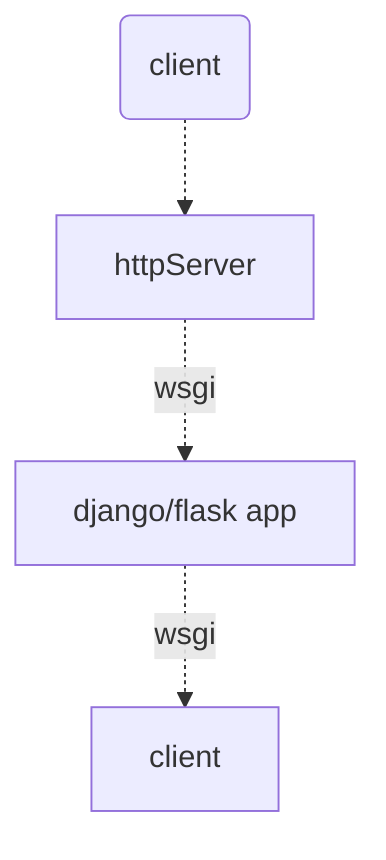

### asgi和wsgi
- **Asgi**,区别于**wsgi**,是python的一个**web异步网关协议**.根据[WSGI协议]('../WSGI/1-python原生的wsgi模块.md'),可知,一个符合WSGI的处理过程是完整的一次同步过程,从` client ---> http server ---> (wsgi) ---> app ---> (wsgi) ---> http server ---> client`.是一个一次性的过程,不支持一个长连接(这里是长连接是指app和client之间是keep-alive).比如websocket.

- asgi有点类似ws,把一个HTTP请求根据不同阶段拆成对应的事件.放到事件循环中.并交给server的event-loop去驱动运行.      

- asgi可以当成wsgi的超集,其可以兼容 **http2/websocket**等协议.以为两者也都可以拆成周期内不同的事件.




```python 

## 最简单的wsgi app
def test_api(environ,start_response):
    print(">>> exec wsgi application")
    status = '200 OK'
    response_headers = [('Content-type', 'text/plain')]
    start_response(status, response_headers)
    return "exec wsgi application finish"

## wsgi handler.run()
def run(self, application):
    """Invoke the application"""
    try:
        self.setup_environ()
        self.result = application(self.environ, self.start_response)
        self.finish_response()
    except (ConnectionAbortedError, BrokenPipeError, ConnectionResetError):
        # We expect the client to close the connection abruptly from time
        # to time.
        return
    except:
        try:
            self.handle_error()
        except:
            # If we get an error handling an error, just give up already!
            self.close()
            raise   # ...and let the actual server figure it out.

```

而一个基础的符合ASGI协议的app如下:   

```python

# 既然ASGI是异步网关协议.即收到请求后到处理的过程全都是异步的，
import asyncio
async def async_app(scope,receive,send):
    print("get scope >>>",scope)
    event = await receive()
    print("get event >>>",event)
    ## 发送回复必须先发送一个 http.response.start 类型的回复消息
    await send({
            'type': 'http.response.start',   # 
            'status': 200,
            'headers': [
                [b'content-type', b'application/json'],
        ]   # 发送响应体内容事件
    })
    await send({
        'type': 'http.response.body',   # 发送响应体内容事件
        'body': "response part1".encode("utf-8"),
        'more_body': True  # 代表后面还有消息要返回
    })
    # await asyncio.sleep(3) # 不能使用time.sleep, 会阻塞整个线程
    await send({
        'type': 'http.response.body',
        'body': "response part2".encode("utf-8"),
        'more_body': False # 已经没有内容了，请求可以结束了
    })


```

和**WSGI**不同,**asgi**用**scope**记录的一些请求信息，类似**WSGI**的**environ**。receive和send都是一个异步的可调用对象，运行时允许被await关键字挂起，不同的协议在ASGI中被拆开成了不同的消息事件类型。因为要做到异步，所以所有东西都要转换成 **receive/send event**来驱动。所有的事件驱动由当前线程的**event-loop**来执行，其中 **recevie** 是用来接收事件,**send**是用来发送事件。

**ASGI**由两部分组成.一为**protocol server**，另外为**ASGI Application**.正如[WSGI]("")由**WSGI SERVER**和**WSGI application**组成一样.**protocol**把请求分成了一个个事件.根据不同协议(比如http/websocket)拆分成不同事件.所有的事件都是在**event-loop**里面执行的.


### http协议
ASGI下一个简单的HTTP请求的scope结果如下,类似于WSGI的environ,在不同的框架中会被再添加额外的信息:

```python
    {
    'type': 'http', ## 协议 
    'asgi': {'version': '3.0', 'spec_version': '2.3'}, 
    'http_version': '1.1', 
    'server': ('127.0.0.1', 5000), 
    'client': ('127.0.0.1', 56784), 
    'scheme': 'http', 
    'method': 'GET', 
    'root_path': '', 
    'path': '/', 
    'raw_path': b'/', 
    'query_string': b'a=2',  // 查询参数
    'headers': [ ## 请求头
        (b'user-agent', b'PostmanRuntime/7.29.0'), 
        (b'accept', b'*/*'), 
        (b'cache-control', b'no-cache'), 
        (b'postman-token', b'4cd8fa6b-600c-4aee-b5a7-c0945cca8c16'), 
        (b'host', b'0.0.0.0:5000'), 
        (b'accept-encoding', b'gzip, deflate, br'), 
        (b'connection', b'keep-alive')
        ]}
```
- 当一个请求到达server时,会建立一个connection.根据不同的协议监听不同的事件.比如http协议的话，就会开始监听#todo.
- connection的生命周期会直到请求结束,比如http的会直到监听到**request.disconnect**


#### http.request event
当client发送了一个HTTP请求时,经过ASGI后,会触发一个**receive**事件,类型为**http.request**,具体结构如下:      

```python
 {
  'type': 'http.request', 
  'body': b'{\r\n    "a":1,\r\n    "b":2\r\n}',  // 请求中的body参数,query参数会放在scope中
  'more_body': False # 如果为TRUE，表示body是分成不同chunk上传的
  }

```


#### http.response.start/http.response.body event
当asgi-app收到一个**http.request**event,处理完业务逻辑后,通过发送一个类型为**http.response.start**的消息表示开始发送回复.同时必须紧接着发送一个类型的**http.response.body**的回复消息事件,如果只有一个**http.response.start**消息,server是不会发送给**client**的

**http.response.start** 结构必须包括 **status**,**header**字段,其实就是**wsgi**中的**start_response**结构如下:     
```python
{
    'type': 'http.response.start',   # 
    'status': 200,
    'headers': [[b'content-type', b'application/json']]  
}

```

**http.response.body** 结构必须包括 **body**,**more_body**字段,**more_body**为**false**表示后续没有回复内容,此时如果在发送类型**http.response.body**的消息,则server会抛出异常
```python
{
    'type': 'http.response.body',
    'body': "response part2".encode("utf-8"),
    'more_body': False # 已经没有内容了，请求可以结束了
}

```

#### http.disconnect连接关闭事件
**http.disconnect** 当响应发送完毕(**http.response.body**且**more_body**为false),或者http中途关闭,此时socket会受到disconnected事件,调用了**receive**的话会收到该事件.
```python

    {'type': 'http.disconnect'}

```

### websocket协议

#### scope
首先看下一个websocket的connection对应的scope都有那些基本字段,其实就是在http的基础上再增加.因为websocket就是在http基础上升级而来的：       

```python
    {
    'type': 'http', ## 协议 
    'asgi': {'version': '3.0', 'spec_version': '2.3'}, 
    'http_version': '1.1', 
    'server': ('127.0.0.1', 5000), 
    'client': ('127.0.0.1', 56784), 
    'scheme': 'http', 
    'method': 'GET', 
    'root_path': '', 
    'path': '/', 
    'raw_path': b'/', 
    'query_string': b'a=2',  // 查询参数
    'headers': [ ## 请求头
        (b'user-agent', b'PostmanRuntime/7.29.0'), 
        (b'accept', b'*/*'), 
        (b'cache-control', b'no-cache'), 
        (b'postman-token', b'4cd8fa6b-600c-4aee-b5a7-c0945cca8c16'), 
        (b'host', b'0.0.0.0:5000'), 
        (b'accept-encoding', b'gzip, deflate, br'), 
        (b'connection', b'keep-alive')
        ]}
    'subprotocols': # client发布的子协议
    '':


```


#### websocket.connect 事件
当客户端发起连接时,**asgi-app**会收到该事件.此时整个websocket还处于握手阶段，所以**asgi-app**必须在收到**websocket.receive**事件之前回复**websocket.accept/close**事件,表示是否建立/关闭此次连接.

#### websocket.accept 事件
由**asgi-app**发送给客户端，一个**websocket.accept**的消息格式如下：    

```python   
    {
        'type':'websocket.accept',
        "subprotocol":"",
        'headers':[()]
    }

```

#### websocket.receive  事件
客户端发送消息时，**asgi-app**会收到该事件:

```python   
    {
        'type':'websocket.receive',
        "bytes":"", #
        'text':"" # if text mode
    }

    "bytes"/'text' 必须有一个不为空

```

#### websocket.send  事件
**asgi-app**向客户端发送消息时触发的事件,告诉server将会发送消息.
```python   
    {
        'type':'websocket.send',
        "bytes":"", #
        'text':"" # if text mode
    }

    "bytes"/'text' 必须有一个不为空

```


#### websocket.disconnect  事件
当connection关闭或者client端关系时，**asgi-app**会收到该事件.该消息的格式为:    
```python   
    {
        'type':'websocket.disconnect',
        "code":"", # 关闭码，默认为1005
    }

```

#### websocket.close 事件
**asgi-app**通知server关闭该ws连接,该消息的格式为:
```python

    {
        'type':'websocket.close',
        "code":"", # 关闭码，默认为1000
        "reason":"" # 关闭理由
    }   


```

上述事件都是**server**和**asgi-app**之间的协议,简化如下:
```mermaid
graph TB
    A(client) -.-> B[asgi-server]
    B[asgi-server]-.websocket.connect/receive/disconnect .->  C[asgi-app]
    C[asgi-app]-.websocket.accept/send/close .-> B[asgi-server]  -.-> A[client]
```


### wsgi-app的生命周期
**wsgi-Application** 会在每个 Connection 中被调用**一**次。Connection 的定义以及其生命周期由**协议规范**决定。对于HTTP来说一个Connection就是一次请求,而对于WebSocket来说一个Connection是一个WebSocket连接(所以如果是websocket协议,必须在asgi-app里面实现对应的websocket事件回调)。
