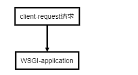
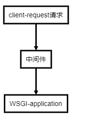

## 基于WSGI网关协议的中间件的设计思路
因为接触到**django**/**flask**的时候，发现他们都有中间件的概念.随便尝试深入了解了下如果基于WGSI去写一个中间件。
通过前面的对WGSI协议的学习，我们知道一个符合WSGI协议的api/view必须满足下列条件(还不了解的话移步[1-python原生的wsgi模块]('./1-python原生的wsgi模块.md'))：
- 1 为可调用方法/类(callable)
- 2 接受envrion,start_Response(wsgi app执行结果回调)两个参数
- 3 wsgi app 返回一个 iter[bytes]

而一个普通的WSGI请求如下:
<!-- ```flow

st=>operation:  client-request请求     
op1=>operation: WSGI-application
st->op1

``` -->


而加了中间件后，就变成

<!-- ```flow

st=>operation:  client-request请求
middle=>operation: 中间件   
op1=>operation: WSGI-application
st->middle->op1


``` -->


所以，中间件既要满足client端的要求，也要满足serve端的要求，即上述的WGSI的3个条件都必须满足.

## 编写一个简单的middleware,在请求前输入和请求后返回做拦截

我们先假设有如下一个api:
```python

def test_api(environ,start_response):
    print(">>> exec wsgi application")
    status = '200 OK'
    response_headers = [('Content-type', 'text/plain')]
    start_response(status, response_headers)
    return "exec wsgi application finish"

```
因为是要对请求前,即为调用**wsgi-app**(即上面的**test_api**)前做操作，所以请求必须从我们写的**middleware**为入口,即为此时我们的**middleware**也是必须符合WsGI标准的,如下所示:
```python

# 函数形式的中间件
def interceptor(environ,start_response):
    print("get a request from client") # before call test_api
    result = test_api(environ,start_response)
    print(f"request is finish,result:{result}") # after call test_api
    if isinstance(res,str):
        res = res.encode("utf-8")
    return [res]


# 类形式的中间件
class Interceptor(object):

    def __init__(self,app) -> None:
        self.app = app

    def __call__(self,environ,start_response) -> Any:
        print("get a request from client") # before call test_api
        res =  self.app(environ=environ,start_response=start_response)
        print(f"request is finish,result:{result}") # after call test_api

        # 返回请求结果
        if isinstance(res,str):
            res = res.encode("utf-8")
        return [res]

```

接下来只要在启动时作为把中间件作为*WSGI APPLICATION*即可:
```python

from wsgiref.simple_server import ServerHandler
# httpd = make_server('localhost', 8051, interceptor) # han
httpd = make_server('localhost', 8051, Interceptor(app=app))
httpd.handle_request()

```

最终我们可以得到输出:
```text
get a request from client  ## 调用前拦截
>>> exec wsgi application  ## 调用
request is finish,result:exec wsgi application finish  ## 调用后拦截
127.0.0.1 - - [13/Feb/2022 02:26:28] "GET /favicon.ico HTTP/1.1" 200 28

```

## 总结
总的来说，middleware就是对wsgi-app的一层包装，多少个middleware就是包装了多少层,同时第一层必须也是符合WSGI标准，也可以当成一个WSGI-App,然后在调用我们定义的wsgi-app的前后做处理。必须紧急，WGSI调用的是app(),不管app是func 或者一个class.所以中间件就是对__call__进行操作

## 多个中间件套娃
