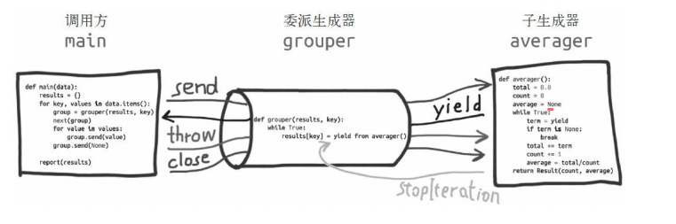

## python中yield        
简单来说,只要函数中加个*yield*关键字,该函数就默认为一个可控制的生成器,可以把*yield*当成return，但此时函数还有灭有执行完成，而是执行到*yield*时状态被保留下来。

### yield生成器终止
* *return*返回(需要在生成器里面做逻辑判断)，生成器会抛出一个*StopIteration*异常.return的值会赋给*exc.value*值

* generator.throw():致使生成器在暂停的 yield 表达式处抛出指定的异常。如果生成器处理了抛出的异常，代码会向前执行到下一个 yield 表达式，而产出的值会成为调用 generator.throw 方法得到的返回值

* genrator.close():不会获取到返回的值

* 获取生成器的值一般用*yield*,最好不要用*return*(会抛出*StopIteration*,return的值会赋值给exc.value)

```python

from inspect import getgeneratorstate
class StopException(Exception):pass

def count():
    total,num = 0,1
    while True:
        try:
            new = yield 
            if new!="stop":
                total+=new
                num+=1
            else:
                break
        except StopException:
            print("throw stop exception")
            # yield total/num
            break
        except StopIteration:
            print(">>> 抛出 StopIteration 异常")
    return total/num

count_iterator = count()
count_iterator.send(None) # 激活，此时会运行到 yield 处返回
count_iterator.send(1) # 从上次 yield 地方继续运行 到下个 yield
count_iterator.send(2) 
count_iterator.send(3)

# 停止1,通过Send值得判断来结束，此时会抛出StopIteration异常,return值在exc.value里面
# try:
#     count_iterator.send("stop")   # 
# except StopIteration as exc:
#     print(">>> res",exc.value) # >>> res 1.5
# print(getgeneratorstate(count_iterator)) # GEN_CLOSED

## 停止2,调用 gen.throw()抛出一个异常,如果 gen里面处理了,则返回值会throw的 exception里面
# try:
#     res = count_iterator.throw(StopException)
# except StopIteration as exc:
#     print(">>> res",exc.value) # >>> res 1.5
# print(getgeneratorstate(count_iterator)) # GEN_CLOSED

## 停止3，调用gen.close()方法,不会返回 return值
# res = count_iterator.close()
# print(">>>",res) # None 不会返回 return值
# print(getgeneratorstate(count_iterator)) # GEN_CLOSED

```

### yield from      
yield from /await:由上面可以知道,单纯的*yield*return时会抛出错误,没办法直接返回.*yield from*可以解决这个问题.这里必须清楚知道2个新的概念:   
- 委托生成器:包含 yield from ``iterable`` 表达式的生成器函数（await）。
- 子生成器: 即为 ``iterable``
- 子生成器可能是简单的迭代器， 只实现了 ```__next__`` 方法；但是，yield from 也能处理这种子生成器。不过，引入 yield from 结构的目的是为了支持实现了 ``__next__``、``send``、``close`` 和 ``throw`` 方法的生成器。       
     
    

- 由图可得,调用方此时直接调用的*yield from*(委托生成器).而非*yield*(子生成器),调用的方的``__next__``、``send``、``close`` 和 ``throw``可以直接通过委托生成器直接发给子生成器(这点跟*yield*一样),而子生成器*return*值则可以直接返回(子生产还是会触发*stopIteration*,不过被委派生成器捕获,直接返回给调用方)，此时委托生成器会继续执行(*yield from*往下执行)

```python
## 使用 yield from 
class StopException(Exception):pass

def count():
    total,num = 0,1
    while True:
        try:
            new = yield 
            if new!="stop":
                total+=new
                num+=1
            else:
                break
        except StopException:
            print("throw stop exception")
            # yield total/num
            break
        except StopIteration:
            print(">>> 抛出 StopIteration 异常")
    return total/num # stopiteration 会返回给委托生成器处理
 
def middle():
    while True:
        res = yield from count()  # 会直到 count() 运行完毕
        print(">>>>>",res)
        # return res # 这里不同return,委托生成器本质上也是一个生成器，这里return会在调用方抛出stopiteration异常

def main():
    count_iterator =  middle()
    count_iterator.send(None) # 
    count_iterator.send(1) # 
    count_iterator.send(2) 
    count_iterator.send(3)
    res = count_iterator.send("stop")   # stopiteration会在委托生成器 middle中处理，而不会返回调用方
    print(res)

main()

```

- 把迭代器当作生成器使用，相当于把子生成器的定义体内联在 yield from 表达式中。此外，子生成器可以执行return语句， 返回一个值，而返回的值会成为yield from 表达式的值(注意这里委托生成器不能用return,否则只能在调用方引发*stopiteration*错误)。

- 子生成器产出的值都直接传给委派生成器的调用方（即客户端代码）。 使用 send() 方法发给委派生成器的值都直接传给子生成器。如果 发送的值是 None，那么会调用子生成器的 ``__next__()`` 方法。如 果发送的值不是 None，那么会调用子生成器的 send() 方法。如 果调用的方法抛出 StopIteration 异常，那么委派生成器恢复运 行。任何其他异常都会向上冒泡，传给委派生成器。生成器退出时，生成器（或子生成器）中的 return expr 表达式 会触发 StopIteration(expr) 异常抛出。 yield from 表达式的值是子生成器终止时传给 StopIteration

- *for*循环机制会捕获*StopIteration*异常而不抛出

#### yield from 逻辑伪代码
```python
_i = iter(EXPR)  
try:
    _y = next(_i) # 激活携程
except StopIteration as _e: 
    _r = _e.value # iter 结束 有 return 则获取 return的值，否为为 None（python 函数默认return None）
else:
    while 1: # 此时委托生成器会阻塞，只作为调用方和子生成器的通道
        try:_
            _s = yield _y  # 迭代
        except GeneratorExit as _e: 
            try:
                # 这一部分用于关闭委派生成器和子生成器。因为子生成器可以是任 何可迭代的对象，所以可能没有 close 方法
                _m = _i.close  
            except AttributeError: 
                pass 
            else:
                _m() # 有close 方法则调用
            raise _e 
        except BaseException as _e: ## 处理 gen.throw()异常
            _x = sys.exc_info() 
            try:
                _m = _i.throw  # 可能没有 throw方法
            except AttributeError: 
                raise _e 
            else: 
                try:
                    _y = _m(*_x) 
                except StopIteration as _e:
                    _r = _e.value 
                    break 
        else: 
            try: 
                # 如果调用方最后发送的值是 None，在子生成器上调用 next 函数， 否则调用 send 方法。
                if _s is None:  
                    _y = next(_i) 
                else:
                    _y = _i.send(_s) 
            except StopIteration as _e: 
                _r = _e.value 
                break
RESULT = _r 

```

### 总结: 
- 一般生成器要获取返回值最好用*yield*,关闭时用*gen.throw* or *gen.close*
- *yield from* 可以接收一个子生成器的*return*值，而不会抛出异常,但是*yield from*所在的生成器如果用*return*，调用方还是引发*StopIteration*异常
- 总的来说，要想生成器中的*return*不抛出异常，只能用*yield from (iterator)*去接收.


## await
*await* 是*yield from*的语法糖,*await iterator* 等价于 *yield from iterator*
