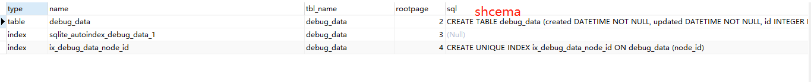
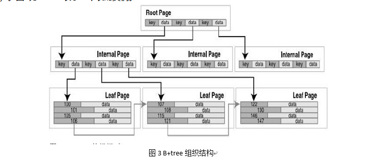
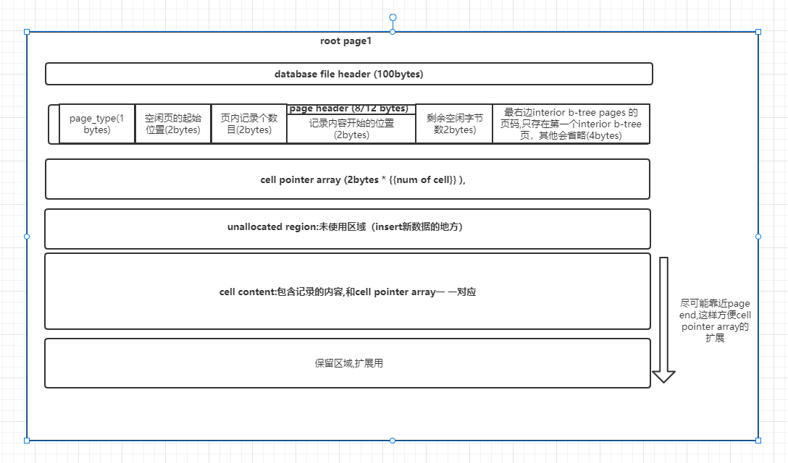
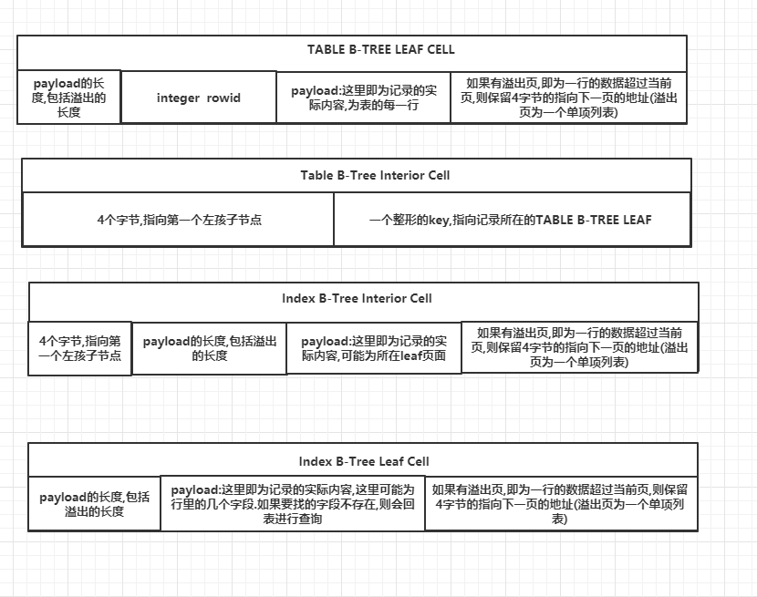
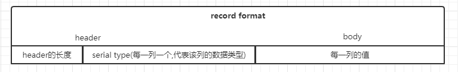

- Q:Alter table 命令支持修改的内容
Alter table:只支持:1.`Alter table tableName Rename TO newName`:修改表名字。 2.`Alter table tableName Rename Column oldColumName TO NewColumnName`.:修改字段名 3.`ALTER TABLE  tableName add column xxx`:增加表字段 4.`ALTER TABLE  tableName Drop Column columnName`:删除表字段（存在主键/唯一键/索引等约束关系时可能删不掉）（#TODO官方文档支持，测试过不支持 - -！）。

```text
1. ALTER TABLE user_account RENAME to 'sss';
2. ALTER TABLE sss  add COLUMN new2;
3. ALTER TABLE sss  add COLUMN new2;
```

- Q:sqlite + alembic 版本管理时.修改字段属性/增加约束关系迁移失败
由于SQLite的alter table 语句不支持去修改字段的属性(比如默认值)/增加字段的约束关系。官方建议是采取`copy and move`的方式。就是先rename旧的表，然后新建一个一样结构的新表(同时增加对应的约束关系).然后把旧表的数据导入到新表.需要手动修改迁移文件：    

```python

"""empty message

Revision ID: 0f5f60fdb2f8
Revises: 71c2b17cd2a0
Create Date: 2022-05-23 09:45:17.127826

"""
from alembic import op
import sqlalchemy as sa

# revision identifiers, used by Alembic.
revision = '0f5f60fdb2f8'
down_revision = '71c2b17cd2a0'
branch_labels = None
depends_on = None


def upgrade():
    # ### commands auto generated by Alembic - please adjust! ###
    ## 会采取 “copy and move”的策略
    with op.batch_alter_table("user_account") as batch_op:
        batch_op.create_unique_constraint("user_name_unique", ['name'])
    # ### end Alembic commands ###


def downgrade():
    # ### commands auto generated by Alembic - please adjust! ###
    ## 会采取 “copy and move”的策略，否则会抛出sqlite语法错误
    with op.batch_alter_table("user_account") as batch_op:
        batch_op.drop_constraint('user_name_unique', type_='unique')
    # ### end Alembic commands ###

### 对应的SQL语句
#### 在原有表的基础加入新的约束关系/字段属性 创建一个新的表
CREATE TABLE _alembic_batch_temp (
    ## 旧的建表语句+新的字段属性
);
#### 把旧的数据从旧的表移动到新的表
INSERT INTO _alembic_batch_temp (id) SELECT some_table.id FROM some_table;
#### 把旧的表删除
DROP TABLE some_table;
#### 把新的表改名为旧的表
ALTER TABLE _alembic_batch_temp RENAME TO some_table;


```

- Sqlite锁的类型,以及用的时机
SQLITE的锁状态可以分为以下5种:
a.UNLOCKED:默认状态，此时可能没有进程对数据库进行读和写操作。
b.SHARED:共享锁. 当对sqlite进行读操作时,需要申请该共享锁.共享锁可存在多个,即可以有多个进程同时进行读操作.当一个或多个共享锁处于活动状态时，不允许其他线程或进程写入数据库文件。
c.RESERVED:保留锁.说明有其他进程将要对数据库进行写入，但此时依然允许其他进程获得Share锁。
d.PENDING:挂起锁说明即将有进程要对sqlite进行写操作,并且等待其他SHARE锁释放,此时不会允许有新的其他Share锁申请(与Reserved不同)。
5.EXCLUSIVE:排他锁说明有其他进程正在进行写操作.此时不允许其他程序获得任何状态的锁。


- Q: SQLites xxx.journal 文件的产生,用途.       
当对SQLITE3文件进行写入操作时,SQLITE会首先生成一个临时的**xxx.journal**文件,这是sqlite的回滚日志文件,记录原始未更改的数据库内容。回滚日志是一个普通的磁盘文件，它总是位于与数据库文件相同的目录或文件夹中，并且与数据库文件具有相同的名称，只是添加了一个-journal后缀。回滚日志还记录数据库的初始大小等信息.如果数据库文件增长，就可以在回滚时将其截断回原来的大小。

- Q: SQLIte对数据库读操作时对 xxx.journal文件的操作
当对数据库进行读操作时,主要分为以下几个步骤：
a.打开数据库文件,申请获取一个**SHARED lock**锁,如果获取失败,说明有其他任务正在写入。返回**SQLITE_BUSY**状态。
b.判断是否有**xxx.journal**文件,如果有,则进行回滚操作。即先申请一个pending锁,在申请一个EXCLUSIVE锁.如果获取失败,说明有其他操作正在进行回滚.则返回**SQLITE_BUSY**状态。否则则等待回滚操作完成，然后删除**xxx.journal**文件。然后释放pending锁和EXCLUSIVE锁,并返回一个SHARE锁


- Q: SQLITE的写流程逻辑:
当对SQLITE进行写入操作时,主要分为以下几个步骤:
a.先获取一个**SHARED**锁(防止有其他进程在进行回滚操作)
b.若获取了share锁后，在获取RESERVED锁,此时其他进程依然可以读取数据,如果无法获取保留锁,说明有其他进程正在写入
c.获取RESERVED锁后，开始创建回滚日志,即xxx.journal文件，将该页的原始内容写入回滚日志。对页面的更改首先保存在内存中，不会写入磁盘。原始数据库文件保持不变，这意味着其他进程可以继续读取数据库。
d.确保了所有回滚日志(xxx.journal)已经写入到磁盘后,会在获取pending锁，知道其他share锁释放完毕,会再去获取EXCLUSIVE排他锁,然后把所有的数据从内容写入到文件中去.然后删除xxx.journal文件，释放pending和exclusive锁.

### Sqlite的存储结构
sqlite是单文件数据库,由多个页面组成,每个数据库文件都有对应100bytes大小的文件头.database的文件头只会在page1第一页出现,但是其他root页面会忽略这100bytes。sqlite数据库的头部包括以下内容:
- 1.header-string(16 bytes):sqlite头部格式标记,固定内容为:"SQLite format 3\000"
- 2.The database page size in bytes(2 bytes):sqlite每一页的大小,范围:512~32768,为1的话代表大小为65536.
- 3.File format write version(1 bytes). 1 代表普通, 2代表WAL模式.大于2时表示改数据库既不能读也不能写.
- 4.File format read version(1 bytes). 1 代表普通, 2代表WAL模式.大于2时表示改数据库既不能读也不能写.
- 5.Bytes of unused "reserved" space at the end of each page(1 bytes):每一页保留的字节数,用于拓展用,为偶数且不能小于480(如果不为0的话)
- 6.Maximum embedded payload fraction(1 bytes): Must be 64.
- 7.Minimum embedded payload fraction(1 bytes): Must be 32.
- 8.Leaf payload fraction(1 bytes): Must be 32.
- 9.File change counter(4 bytes):数据库文件改变的次数.在非WAL的模式下,每次修改过,该字节都会加1.当有多个进程同时访问同一个数据库时,可以通过改字段来判断是否修改。
- 10.Size of the database file in pages(4 bytes):
- 11.Page number of the first freelist trunk page(4 bytes):
- 13.Total number of freelist pages(4 bytes):未被使用的页列表，比如删除了一些数据.就会有一些空余的页面.
- 14.The schema cookie(4 bytes):每次修改表结构时,该字段会自动加1,运行建表语句,会检测改字段的值,如果和建表语句创建时不一致,则不会运行建表语句
- 15.The schema format number(4 bytes): Supported schema formats are 1, 2, 3, and 4,表格式版本号?
- 16.Default page cache size(4 bytes):缓存页面大小
- 17.The page number of the largest root b-tree page when in auto-vacuum or incremental-vacuum modes, or zero otherwise.
- 18.The database text encoding(4 bytes):数据库文件内容编码：1代表UTF-8. 2代表 UTF-16le. 3代表UTF-16be.
- 19.The "user version" as read and set by the user_version pragma.
- 20.True (non-zero) for incremental-vacuum mode. False (zero) otherwise.
- 21.The "Application ID" set by PRAGMA application_id.
- 22.Reserved for expansion. Must be zero.
- 23.The version-valid-for number.
- 24.SQLITE_VERSION_NUMBER

同理,一个数据库是由多个B-tree组成的——每张表以及每个索引各对应一个B-tree。数据库中每张表或索引都以根页面作为第一页。所有的索引和表的根页面都存储在sqlite_master表中.


SQlite的存储同样使用的B树,可以分表和索引,表数据的存储使用的是B+树,索引的存储使用的是普通B树.格式如下:   

每颗B树的root page可以分为以下几个部分:
- 1. 100bytes大小的database file header,这个只有在page1有
- 2. 8/12字节的page header,这个每一页都有.page header主要由几个部分组成:a.page type(1bytes): `(0x02)`代表该页是索引B树里面的一个`interior page`.`(0x05)`代表该页是表B树里面的一个`interior page`. `(0x0a)`代表该页是索引B树里面的一个`leaf page`.`(0x0d)`代表该页是表B树里面的一个`leaf page`. b.page freeblocks的起始位置(2 bytes). c.当前页cell的数量(2bytes):即当前page key-value的数量 d.cell开始的位置(2 bytes) e.cell区域中的空闲字节数(1 bytes) f.
- 3. cell pointer array:指向cell内容的指针数组(即为key),长度为2-bytes整形.并且从小到大排序(cell是page里面再分配的单位.cell的长度不是固定的,每个cell对应一条记录)
- 4. Unallocated space:page中未分配区域
- 5. The cell content area:cell的内容(即存放实际记录的地方),在sqlite中，cell content总是从page的结束位置区域开始,这样是为了cell pointer array能够更好的扩展。(所以 cell pointer array和The cell content area之间会有一个Unallocated space)
- 6. The reserved region:保留区域，用来扩充page信息 


#### B-tree cell的结构
cell是page里面再分配的单位.cell的长度不是固定的,每个cell是对一条记录的封装.cell内容的格式跟节点的类型挂钩,主要分为四类:
- 1. table B-Tree Leaf Cell:表b-tree叶子节点.由四部分组成:a.数据的大小(bytes).b.一个整形的id(例如row-id). c.payload:即数据 d.如果数据一页装不下,还会有4个字节大小指向存放溢出数据下一页的地址,如果数据没有溢出,则忽略
- 2. Table B-Tree Interior Cell:表B-tree树内部节点,由两部分组成:a.一个4字节的页码,指向左子节点 b.一个整形的key

- 3. Index B-Tree Leaf Cell：索引b-tree叶子节点。由三部分组成:a.数据的大小(bytes),包括溢出部分 b.payload:即数据(如果有溢出,则是没有溢出部分) c.如果数据一页装不下,还会有4个字节大小指向存放溢出数据页列表第一页的地址,如果数据没有溢出,则忽略
- 4.Index B-Tree Interior Cell：索引b-tree内部节点，由四部分组成:a.一个4字节的页码,指向左子节点. b.:a.数据的大小(bytes) c.payload:即数据(如果有溢出,则是没有溢出部分). d.如果数据一页装不下,还会有4个字节大小指向存放溢出数据页列表第一页的地址,如果数据没有溢出,则忽略



<!-- #### record
sqlite page中的记录包括一个**header**和**body**:header以一个variant值开始，代表这header的总长度(包括variant值的长度).variant值后面是一些代表其他含义的variant值.每列一个，这些决定了每一列的数据类型. -->


#### sqlite record 格式
无论是表Btree叶子节点，还是索引BTREE,拥有相同的**record format**格式,该格式包含的表的列和索引的相关信息，可以分为header和body两个部分.header主要由header长度,每一列的类型(datatype)组成,body由每一列的值组成:   



serial type代表的值的类型如下:
| serial type       | 代表的值的类型 |
| -----------       | ----------- |
| 0                 |表示列的值为null,大小为0bytes       |
| 1         |表示列的值是一个8位的整型(二进制补码的形式)(1 bytes)    |
| 2         |表示列的值是一个16位的整型(二进制补码的形式)(2 bytes)    |
| 3         |表示列的值是一个24位的整型(二进制补码的形式)(3 bytes)    |
| 4         |表示列的值是一个32位的整型(二进制补码的形式)(4 bytes)    |
| 5         |表示列的值是一个48位的整型(二进制补码的形式)(6 bytes)    |
| 6         |表示列的值是一个64位的整型(二进制补码的形式)(8 bytes)    |
| 7         |表示列的值是整数0(0 bytes)    |
| 8         |表示列的值是整数1(0 bytes)    |
| 9         |表示列的值是一个 64位浮点数(8 bytes)    |
| 10，11         |SQLITE内部使用,可能为生成临时数据库文件时用到   |
| N>=12且为偶数        |表示值时一个blob类型,大小为 (N-12)/2 BYTES   |
| N>=13且为奇数        |表示值时一个text类型,大小为 (N-13)/2 BYTES   |


header size varint 和 serial type varints 一般由1个字节组成,erial type varints代表BLOB和TEXT时，可以由多个字节组成。


### sqlite row id 和  INTEGER PRIMARY KEY
sqlite中表的每一行数据始终存在于表B-TREE的叶子节点中,表B-tree非叶子节点存放的row_id(自动维护的一个隐藏的列rowid),主键在`record`为null值,不会存在record中,SQLITE每个表都默认有一个row_id列，除非创建表的时候显式指定不创建row_id,
当定义了一个自增的整形主键（类型必须严格为**Integer**）,那么该主键将作为row_id的别名,即都是代表的row_id

### sqlite with row id 
当前sqlite创建表的时候显示指定了**without row id**时,sqlite使用的**index b-tree**来储存，而非表B-tree,储存的格式跟表B-tree一样，只是会把**PRIMARY KEY**列放在前面,作为索引B-tree的Key.


#### 索引B-tree树
索引B-tree树的每一条记录对应着表中的每一行记录,由被索引的列和对应的row_id(如果表创建时没有指明row_id,则由PRIMARY KEY)组成。