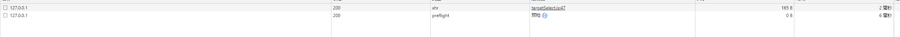
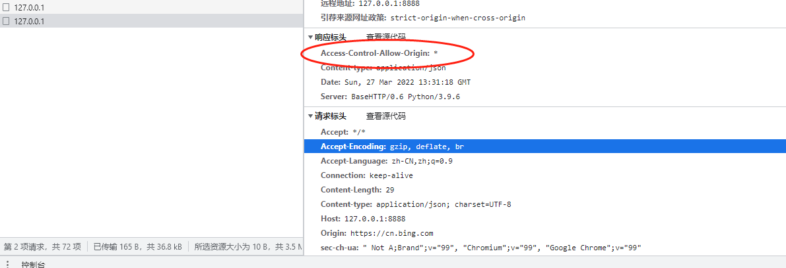

# 什么是跨域(cros)
跨域是浏览器的一种安全同源策略，其限制了当前允许JS请求的服务器范围,必须满足**同源**的条件。否则就会抛出*cors*请求出错

> 一个典型的请求跨域错误


## 什么是同源
**同源**即**当前的url**和**请求的url**必须满足**同协议,同服务器,同端口**,比如当前的页面url为 *http://127.0.0.1:8080*,那么
* 同源的情况
> http://127.0.0.1:8080/dir1
> http://127.0.0.1:8080/dir2/dir3

* 不同源的情况
> https://127.0.0.1:8080 //协议不同
> http://127.0.0.1:8082  // 端口不同
> http://127.0.0.2:8080 // 域名不同

当出现请求地址和当前地址不同源的情况时,浏览器会对http请求头加上**origin**,服务器收到后,倘若响应头中没有包含**Access-Control-Allow-Origin**,或者**Access-Control-Allow-Origin**中没有包括请求头中的**origin**,就会抛出跨域错误。


# 关于跨域时出现的 *option* 预检请求
当出现跨域,且请求为**非简单**请求时,浏览器会预先向服务发送一个**option**请求,来检验改请求是否被允许.

## 简单请求
一个简单请求必须满足以下条件:
* 请求方法为 HEAD / POST /GET
* 请求头中Content-Type 为 *application/x-www-form-urlencoded*,*multipart/form-data*,*text/plain*
否则该请求会被浏览器认为是复杂请求，当出现跨域时浏览器会发送*option*预检请求


> 一个 Content-Type 为 *application/json* 的跨域请求



## 服务端预检的处理
服务端收到浏览器的option请求时，返回的响应头必须携带以下字段:
* Access-Control-Allow-Origin: '*'       (允许的请求源)
* Access-Control-Allow-Methods: POST, GET, OPTIONS (允许的请求方法)
* Access-Control-Allow-Headers: X-PINGOTHER, Content-Type (服务端会去解析的的请求头字段)
* Access-Control-Max-Age: 60 (预检的缓存时间,60秒内不会在发送预检) 


# 解决跨域的问题

## nginx
前面我们知道跨域是由于浏览器向非同源的服务端发送了请求导致的，在前后端分离盛行的今天，这种场景基本很常见,那么只要在请求到达服务端前加一层转发,而不是直接到达服务端,不久可以解决这个问题了吗🤭,所以...可以搞一个nginx反向代理，前端请求和后端请求都统一走的nginx的代理端口,在浏览器看来，都是走的同一个服务器端口,所以就不会触发跨域问题.

todo 思考.如果前端不走nginx是否就不行？猜测估计会有跨域问题,待验证


## 服务端解决
由前面我们可以知道,出现跨域是因为服务端没有返回的响应头中*Access-Control-Allow-Origin*没有包含浏览器请求头中*origin*字段的缘故，所以我们可以在请求响应头添加对应的*Access-Control-Allow-Origin*即可.
如:
```python
class Resquest(BaseHTTPRequestHandler):

    def do_GET(self):
        self.send_response(200)
        # self.send_header('Content-type', 'application/json')
        self.send_header('Access-Control-Allow-Origin','*') # 允许跨域
        self.end_headers()
        self.wfile.write("get OK".encode())

    def do_POST(self):
        pay_load_length = int(self.headers.get('Content-length', 0))
        data = self.rfile.read(pay_load_length).decode()
        print(">>>get body",data)
        #  do sth
        self.send_response(200)
        self.send_header('Content-type', 'application/json')
        self.send_header('Access-Control-Allow-Origin','*') # 允许跨域
        self.end_headers()
        self.wfile.write("hello post".encode())

    def do_OPTIONS(self):
        print(self.headers)
        self.send_response(200)
        self.send_header('Access-Control-Allow-Methods', '*')
        self.send_header('Access-Control-Allow-Headers','*') 
        self.send_header('Access-Control-Allow-Origin','*')
        # self.send_header("Access-Control-Max-Age",30*60) # 缓存cor 30分钟内不再发送option7
        self.end_headers()

```

> 处理后POST请求已经可以发送成功



ps: *是非常暴力的方式,最好直接指定一些具体的域名
