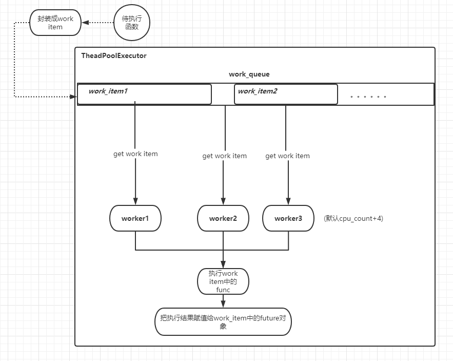

## future
在线程中，future表示一个task的执行结果.当调用线程池的*submit*后.会返回一个future.线程池的执行结果都会封装在*future*里面。有点类似协程中的*future*.concurrent中的**future**的源码和注释如下👇：  

```python
class Future(object):
    # 代表一个work_item（封装了task的对象）的执行结果
    def __init__(self):
        """Initializes the future. Should not be called by clients."""
        self._condition = threading.Condition()
        self._state = PENDING # 执行状态
        self._result = None  # 执行结果
        self._exception = None # 如果异常，这里存放异常结果
        self._waiters = []  # 
        self._done_callbacks = [] # 存放完成后待执行的回调函数列表

    def _invoke_callbacks(self):
        # 执行回调函数
        for callback in self._done_callbacks:
            try:
                callback(self) # 线程池中task的执行完成的回调函数的第一个参数都是回调函数本身
            except Exception:
                LOGGER.exception('exception calling callback for %r', self)


    def cancel(self):
        # 取消work_item的执行,前提是该work_item还未执行/执行完成
        with self._condition:
            if self._state in [RUNNING, FINISHED]:
                # 已经执行/执行完成 ---> 取消失败
                return False

            if self._state in [CANCELLED, CANCELLED_AND_NOTIFIED]:
                return True

            self._state = CANCELLED
            self._condition.notify_all() # 通知其他等待该task执行完成才需要执行的任务

        self._invoke_callbacks() # 执行回调函数
        return True


    def add_done_callback(self, fn):
        with self._condition:
            if self._state not in [CANCELLED, CANCELLED_AND_NOTIFIED, FINISHED]:
                # 不是执行完成状态，添加到 callback 列表
                self._done_callbacks.append(fn)
                return
        try:
            # 已经执行完成,马上执行callback
            fn(self)
        except Exception:
            LOGGER.exception('exception calling callback for %r', self)

    def result(self, timeout=None):
        
        try:
            with self._condition:
                if self._state in [CANCELLED, CANCELLED_AND_NOTIFIED]:
                    raise CancelledError()
                elif self._state == FINISHED:
                    return self.__get_result()

                # future还不是done状态,等待timeout时间
                self._condition.wait(timeout)

                if self._state in [CANCELLED, CANCELLED_AND_NOTIFIED]:
                    raise CancelledError()
                elif self._state == FINISHED:
                    return self.__get_result()
                else:
                    raise TimeoutError()
        finally:
            # Break a reference cycle with the exception in self._exception
            self = None

    def exception(self, timeout=None):
        with self._condition:
            if self._state in [CANCELLED, CANCELLED_AND_NOTIFIED]:
                raise CancelledError()
            elif self._state == FINISHED:
                return self._exception

            self._condition.wait(timeout)

            if self._state in [CANCELLED, CANCELLED_AND_NOTIFIED]:
                raise CancelledError()
            elif self._state == FINISHED:
                return self._exception
            else:
                raise TimeoutError()

    # The following methods should only be used by Executors and in tests.
    def set_running_or_notify_cancel(self):
        """Mark the future as running or process any cancel notifications.

        Should only be used by Executor implementations and unit tests.

        If the future has been cancelled (cancel() was called and returned
        True) then any threads waiting on the future completing (though calls
        to as_completed() or wait()) are notified and False is returned.

        If the future was not cancelled then it is put in the running state
        (future calls to running() will return True) and True is returned.

        This method should be called by Executor implementations before
        executing the work associated with this future. If this method returns
        False then the work should not be executed.

        Returns:
            False if the Future was cancelled, True otherwise.

        Raises:
            RuntimeError: if this method was already called or if set_result()
                or set_exception() was called.
        """
        # 设置 future的状态
        with self._condition:
            if self._state == CANCELLED:
                self._state = CANCELLED_AND_NOTIFIED
                for waiter in self._waiters:
                    waiter.add_cancelled(self)
                # self._condition.notify_all() is not necessary because
                # self.cancel() triggers a notification.
                return False
            elif self._state == PENDING:
                self._state = RUNNING
                return True
            else:
                LOGGER.critical('Future %s in unexpected state: %s',
                                id(self),
                                self._state)
                raise RuntimeError('Future in unexpected state')

    def set_result(self, result):
        # 设置线程池中work_item的执行结果，result就是执行函数的返回值
        with self._condition:
            if self._state in {CANCELLED, CANCELLED_AND_NOTIFIED, FINISHED}:
                raise InvalidStateError('{}: {!r}'.format(self._state, self))
            self._result = result
            self._state = FINISHED
            for waiter in self._waiters:
                waiter.add_result(self)
            self._condition.notify_all()
        self._invoke_callbacks()

    def set_exception(self, exception):

        with self._condition:
            if self._state in {CANCELLED, CANCELLED_AND_NOTIFIED, FINISHED}:
                raise InvalidStateError('{}: {!r}'.format(self._state, self))
            self._exception = exception
            self._state = FINISHED
            for waiter in self._waiters:
                waiter.add_exception(self)
            self._condition.notify_all()
        self._invoke_callbacks()


```


## worker
*worker*是线程池中实际运行的函数.每个*worker*都会从*worker_queue*(线程池中所有worker共享,存放实际运行的task)中获取用户提交的task(被封装成workItem)并运行。    
```python
def _worker(executor_reference, work_queue, initializer, initargs):
    # executor_reference为线程池执行器executor的弱引用
    # worker初始化
    if initializer is not None:
        try:
            initializer(*initargs)
        except BaseException:
            _base.LOGGER.critical('Exception in initializer:', exc_info=True)
            executor = executor_reference()
            if executor is not None:
                executor._initializer_failed()
            return
    try:
        while True:
            # 不断从 work_queue 获取任务执行
            work_item = work_queue.get(block=True)
            if work_item is not None:
                work_item.run()
                # Delete references to object. See issue16284
                del work_item

                # attempt to increment idle count
                executor = executor_reference()
                if executor is not None:
                    executor._idle_semaphore.release() # 运行完毕 释放 _idle_semaphore,这是一个信号量，代表空闲的worker数量，此处代表有一个空闲的worker
                del executor
                continue
            
            ## 为None。结束worker线程
            executor = executor_reference()
            # Exit if:
            #   - The interpreter is shutting down OR
            #   - The executor that owns the worker has been collected OR
            #   - The executor that owns the worker has been shutdown.
            if _shutdown or executor is None or executor._shutdown:
                # Flag the executor as shutting down as early as possible if it
                # is not gc-ed yet.
                if executor is not None:
                    executor._shutdown = True
                # 通知其他worker，避免一直block在 work_queue.get（）中
                work_queue.put(None) 
                return
            del executor
    except BaseException:
        _base.LOGGER.critical('Exception in worker', exc_info=True)
```


## worker_item
对用户提交函数的封装,包括运行的函数，入参，存放结果的*future*等.源码如下:       
```python

    class _WorkItem(object):
        def __init__(self, future, fn, args, kwargs):
            self.future = future # 存放运行的结果
            self.fn = fn # 运行的函数
            self.args = args # 
            self.kwargs = kwargs

        def run(self):
            if not self.future.set_running_or_notify_cancel():
                return
            try:
                result = self.fn(*self.args, **self.kwargs)
            except BaseException as exc:
                self.future.set_exception(exc)
                # Break a reference cycle with the exception 'exc'
                self = None
            else:
                self.future.set_result(result)
  
        __class_getitem__ = classmethod(types.GenericAlias)


```


## ThreadPoolExecutor

先看python中ThreadPoolExecutor的源码    

```python

class ThreadPoolExecutor(_base.Executor):

    # Used to assign unique thread names when thread_name_prefix is not supplied.
    _counter = itertools.count().__next__

    def __init__(self, max_workers=None, thread_name_prefix='',
                 initializer=None, initargs=()):
        if max_workers is None:
            # ThreadPoolExecutor is often used to:
            # * CPU bound task which releases GIL
            # * I/O bound task (which releases GIL, of course)
            #
            # We use cpu_count + 4 for both types of tasks.
            # But we limit it to 32 to avoid consuming surprisingly large resource
            # on many core machine.
            max_workers = min(32, (os.cpu_count() or 1) + 4)
        if max_workers <= 0:
            raise ValueError("max_workers must be greater than 0")

        if initializer is not None and not callable(initializer):
            raise TypeError("initializer must be a callable")

        self._max_workers = max_workers
        self._work_queue = queue.SimpleQueue()
        self._idle_semaphore = threading.Semaphore(0)
        self._threads = set() # 存放worker实例
        self._broken = False
        self._shutdown = False
        self._shutdown_lock = threading.Lock()
        self._thread_name_prefix = (thread_name_prefix or
                                    ("ThreadPoolExecutor-%d" % self._counter()))
        self._initializer = initializer
        self._initargs = initargs

    def submit(self, fn, /, *args, **kwargs):
        with self._shutdown_lock, _global_shutdown_lock:
            if self._broken:
                raise BrokenThreadPool(self._broken)

            if self._shutdown:
                raise RuntimeError('cannot schedule new futures after shutdown')
            if _shutdown:
                raise RuntimeError('cannot schedule new futures after '
                                   'interpreter shutdown')

            # 把待执行函数封装成 work_item
            f = _base.Future()
            w = _WorkItem(f, fn, args, kwargs)

            # PUSH到线程池中所有worker共享的_work_queue中
            self._work_queue.put(w)
            self._adjust_thread_count()
            return f # 返回提交的func对应的future

    submit.__doc__ = _base.Executor.submit.__doc__

    def _adjust_thread_count(self):
        # if idle threads are available, don't spin new threads
        if self._idle_semaphore.acquire(timeout=0):
            return

        # When the executor gets lost, the weakref callback will wake up
        # the worker threads.
        def weakref_cb(_, q=self._work_queue):
            q.put(None)

        num_threads = len(self._threads)
        if num_threads < self._max_workers:
            thread_name = '%s_%d' % (self._thread_name_prefix or self,
                                     num_threads)
            t = threading.Thread(name=thread_name, target=_worker,
                                 args=(weakref.ref(self, weakref_cb), # executor_reference为线程池执行器executor的弱引用,当_work方法中删除了executor时，会调用weakref_cb
                                       self._work_queue,
                                       self._initializer,
                                       self._initargs))
            t.start()
            self._threads.add(t)
            _threads_queues[t] = self._work_queue

    def _initializer_failed(self):
        with self._shutdown_lock:
            self._broken = ('A thread initializer failed, the thread pool '
                            'is not usable anymore')
            # Drain work queue and mark pending futures failed
            # 一但初始化失败,对于work_Queue中的所有work_item设置为异常
            while True:
                try:
                    work_item = self._work_queue.get_nowait()
                except queue.Empty:
                    break
                if work_item is not None:
                    work_item.future.set_exception(BrokenThreadPool(self._broken))

    def shutdown(self, wait=True, *, cancel_futures=False):
        with self._shutdown_lock:
            self._shutdown = True
            if cancel_futures:
                # Drain all work items from the queue, and then cancel their
                # associated futures.
                while True:
                    try:
                        work_item = self._work_queue.get_nowait()
                    except queue.Empty:
                        break
                    if work_item is not None:
                        work_item.future.cancel()

            # Send a wake-up to prevent threads calling
            # _work_queue.get(block=True) from permanently blocking.
            self._work_queue.put(None)
        if wait:
            for t in self._threads:
                t.join()
    shutdown.__doc__ = _base.Executor.shutdown.__doc__


```
- ThreadPoolExecutor中有几个比较重要的属性:
    1._max_workers:最大工作线程数 
    2._work_queue:任务队列.每次用户提交的task都会被push到任务队列里面.
    3._idle_semaphore,是否有空闲的*worker*，是的话不会再去创建新的*worker*。
- 调用submit后会生成一个*future*,用来存放task的运行成果.然后会生成一个*work_item*并push到*work_queue*里面.
- _adjust_thread_count是调整线程池大小.主要是根据`_idle_semaphore`来判断，如果acquire成功,说明有空闲的*worker*,则不创建.否则创建一个一个新的*worker*


## waiter
当有需要等待线程池中某个task执行完成时,可以定义一个waiter,来等待对应的future执行完成.**Future**类中有一个**waiter**列表属性,表示当前等他其执行完成的waiter对象.waiter有3种类型,分别为1.等待第一次执行完成(FIRST_COMPLETED). 2.第一次异常(FIRST_EXCEPTION) 3.所有任务执行完成(ALL_COMPLETED).waiter的源码和注释如下👇:


```python

class _Waiter(object):
    """Provides the event that wait() and as_completed() block on."""
    def __init__(self):
        self.event = threading.Event() # 表示waiter等待的Future已经完成
        self.finished_futures = []

    def add_result(self, future):  # 把完成的future添加到 waiter.finished_futures列表里面
        self.finished_futures.append(future)

    def add_exception(self, future):
        self.finished_futures.append(future)

    def add_cancelled(self, future):
        self.finished_futures.append(future)

class _AsCompletedWaiter(_Waiter):
    """Used by as_completed()."""

    def __init__(self):
        super(_AsCompletedWaiter, self).__init__()
        self.lock = threading.Lock()

    def add_result(self, future):
        with self.lock:
            super(_AsCompletedWaiter, self).add_result(future)
            self.event.set()

    def add_exception(self, future):
        with self.lock:
            super(_AsCompletedWaiter, self).add_exception(future)
            self.event.set()

    def add_cancelled(self, future):
        with self.lock:
            super(_AsCompletedWaiter, self).add_cancelled(future)
            self.event.set()

class _FirstCompletedWaiter(_Waiter):
    """Used by wait(return_when=FIRST_COMPLETED)."""

    def add_result(self, future):
        super().add_result(future)
        self.event.set()

    def add_exception(self, future):
        super().add_exception(future)
        self.event.set()

    def add_cancelled(self, future):
        super().add_cancelled(future)
        self.event.set()

class _AllCompletedWaiter(_Waiter):
    """Used by wait(return_when=FIRST_EXCEPTION and ALL_COMPLETED)."""

    def __init__(self, num_pending_calls, stop_on_exception):
        self.num_pending_calls = num_pending_calls # 等到结束的所有futures的数量
        self.stop_on_exception = stop_on_exception # 当return_when参数为 FIRST_EXCEPTION 时,为True,代表在第一次异常时结束等待
        self.lock = threading.Lock()
        super().__init__()

    def _decrement_pending_calls(self):
        with self.lock:
            self.num_pending_calls -= 1 # 等待结束的futures的数量-1
            if not self.num_pending_calls:
                self.event.set()

    def add_result(self, future): # 有一个future完成,等待的futs的总数-1
        super().add_result(future)
        self._decrement_pending_calls()

    def add_exception(self, future):
        super().add_exception(future)
        if self.stop_on_exception: # 如果 return_when参数为 FIRST_EXCEPTION,代表在第一次异常时结束等待.否则继续 -1
            self.event.set()
        else:
            self._decrement_pending_calls()

    def add_cancelled(self, future):
        super().add_cancelled(future)
        self._decrement_pending_calls()


def _create_and_install_waiters(fs, return_when):
    if return_when == _AS_COMPLETED: # 只要有一个 fut 执行完成就停止等待
        waiter = _AsCompletedWaiter()
    elif return_when == FIRST_COMPLETED:
        waiter = _FirstCompletedWaiter()  # 只要有一个 fut 执行完成就停止等待
    else:
        pending_count = sum(
                f._state not in [CANCELLED_AND_NOTIFIED, FINISHED] for f in fs)

        if return_when == FIRST_EXCEPTION:
            waiter = _AllCompletedWaiter(pending_count, stop_on_exception=True) #  只要有一个 fut 异常就停止等待
        elif return_when == ALL_COMPLETED:
            waiter = _AllCompletedWaiter(pending_count, stop_on_exception=False) # 所有的 futs 执行完成再停止等待
        else:
            raise ValueError("Invalid return condition: %r" % return_when)

    for f in fs: # 把该waiter添加到对应的fut.waiter列表里面
        f._waiters.append(waiter)

    return waiter

```

## as_completed:存放任务列表执行结果futures的迭代器
concurrent提供了**as_completed**方法,返回一个存放所有task执行结果futs的迭代器,调用程序可以通过这个去等待并获取所有的task的执行结果.

```python

def _yield_finished_futures(fs, waiter, ref_collect):
    # 将已经完成的futs一个个返回
    while fs:
        f = fs[-1]
        for futures_set in ref_collect:
            futures_set.remove(f)
        with f._condition:
            f._waiters.remove(waiter)
        del f
        # Careful not to keep a reference to the popped value
        yield fs.pop()


#  返回一个可以迭代的对象.
def as_completed(fs, timeout=None):

    if timeout is not None:
        end_time = timeout + time.monotonic()

    fs = set(fs)
    total_futures = len(fs)

    with _AcquireFutures(fs):
        # 先获取 所有 已经完成/等待执行的 futs
        finished = set(
                f for f in fs
                if f._state in [CANCELLED_AND_NOTIFIED, FINISHED])
        pending = fs - finished

        # 创建一个waiter 即为as_completed的调用方
        waiter = _create_and_install_waiters(fs, _AS_COMPLETED)
    finished = list(finished)
    try:
        # 先依次返回状态已经为完成的future
        yield from _yield_finished_futures(finished, waiter,
                                            ref_collect=(fs,))

        while pending:
            # 如果还有等待完成的任务,只不断等待,直到pengding列表里面所有的任务执行完成
            if timeout is None:
                wait_timeout = None
            else:
                wait_timeout = end_time - time.monotonic() # 下次需要等待的时间
                if wait_timeout < 0:
                    # 超过总时间,抛出超时异常
                    raise TimeoutError(
                            '%d (of %d) futures unfinished' % (
                            len(pending), total_futures))

            # # 一但有future完成,会调用 set waiter.event，否则会一直阻塞直到timeout,然后继续往下执行
            waiter.event.wait(wait_timeout)

            with waiter.lock:
                finished = waiter.finished_futures
                waiter.finished_futures = []
                waiter.event.clear() # 取消set，下次循环继续会继续阻塞在 wait.event.wait(wait_timeout)

            # reverse to keep finishing order
            finished.reverse()
            # 将这次timeout周期内已经完成的新的future再逐个弹出
            yield from _yield_finished_futures(finished, waiter,
                                                ref_collect=(fs, pending))

    finally:
        # Remove waiter from unfinished futures
        for f in fs:
            with f._condition:
                f._waiters.remove(waiter)

```
- 当我们使用了**as_completed**返回一个iter时,调用方可以通过**for future in iter**的形式来处理和等待直到所有futs执行完成.
- timeout参数代表了等待所有futs的最长等待时间
- 当没有执行完成的futs时,进入等待状态,调用的**threading.Event().wait()**,在timeout时间周期内,如果有任务执行完成.则fut会调用set threading.event(),waiter会中断等待,继续迭代已经完成的future,直到总的耗时超过timeout或者全部futures已经执行完成.


## 总结
总的来说,ThreadPoolExecutor是通过生成对应的数量的*worker*来执行用户提交的task.worker每执行完一个任务后并不会销毁（不同于普通线程）而是去不断从轮询*ThreadPoolExecutor.worker_Queue*队列,知道有新任务到来并执行.从而达到线程复用,避免频繁的线程创建销毁和切换。当然，如果的执行的逻辑周期较长,可能就不适合用线程池来处理(长期霸占一个*worker*).



