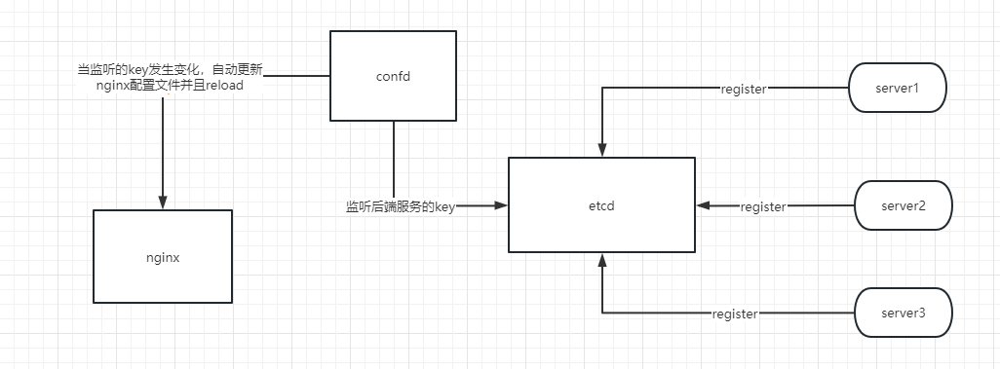

## 背景
因为最近把网站的一些功能拆解了出来做成了独立的服务.为了实现能够做到一个服务自动注册发现的效果,需要引入一个服务发现的功能.按照现有的主流方案,一般都会在网关集成服务发现的功能，在服务发现方案上选择了 `etcd`,因为目前网关采用的nginx,而不是自定义的网关,因此想能够实现 `服务` --> `etcd` --> `nginx更新路由并重启`,又引入了`confd`,具体如下:  




### confd
Confd是一个轻量级的配置管理工具。通过查询后端存储，结合配置模板引擎，保持本地配置最新，同时具备定期探测机制，配置变更自动reload。简单来说,就是不断轮询etcd,如果订阅的key发生了变动，就重新生成nginx的配置文件，同时并重新启动nginx.

#### 实战

本次案例可以在个人网站的[网关部分](https://github.com/weridolin/site-usercenter)找到。

- 第一步先启动对应的etcd3集群

```yaml
version: "3"
services:
  etcd1:
    image: bitnami/etcd:latest  # 镜像
    container_name: site-etcd-1       # 容器名 --name
    # restart: always             # 总是重启
    networks:
      - site              # 使用的网络 --network
    ports:                      # 端口映射 -p
      - "20000:2379"
      - "20001:2380"
    environment:                # 环境变量 --env
      - ALLOW_NONE_AUTHENTICATION=yes                       # 允许不用密码登录
      - ETCD_NAME=etcd1                                     # etcd 的名字
      - ETCD_INITIAL_ADVERTISE_PEER_URLS=http://etcd1:2380  # 列出这个成员的伙伴 URL 以便通告给集群的其他成员
      - ETCD_LISTEN_PEER_URLS=http://0.0.0.0:2380           # 用于监听伙伴通讯的URL列表
      - ETCD_LISTEN_CLIENT_URLS=http://0.0.0.0:2379         # 用于监听客户端通讯的URL列表
      - ETCD_ADVERTISE_CLIENT_URLS=http://etcd1:2379        # 列出这个成员的客户端URL，通告给集群中的其他成员
      - ETCD_INITIAL_CLUSTER_TOKEN=site-etcd-cluster             # 在启动期间用于 etcd 集群的初始化集群记号
      - ETCD_INITIAL_CLUSTER=etcd1=http://etcd1:2380,etcd2=http://etcd2:2380,etcd3=http://etcd3:2380 # 为启动初始化集群配置
      - ETCD_INITIAL_CLUSTER_STATE=new                      # 初始化集群状态
    # volumes:
    #   - etcd1_data:/bitnami/etcd                            # 挂载的数据卷

  etcd2:
    image: bitnami/etcd:latest
    container_name: site-etcd-2 
    # restart: always
    networks:
      - site
    ports:
      - "20002:2379"
      - "20003:2380"
    environment:
      - ALLOW_NONE_AUTHENTICATION=yes
      - ETCD_NAME=etcd2
      - ETCD_INITIAL_ADVERTISE_PEER_URLS=http://etcd2:2380
      - ETCD_LISTEN_PEER_URLS=http://0.0.0.0:2380
      - ETCD_LISTEN_CLIENT_URLS=http://0.0.0.0:2379
      - ETCD_ADVERTISE_CLIENT_URLS=http://etcd2:2379
      - ETCD_INITIAL_CLUSTER_TOKEN=site-etcd-cluster
      - ETCD_INITIAL_CLUSTER=etcd1=http://etcd1:2380,etcd2=http://etcd2:2380,etcd3=http://etcd3:2380
      - ETCD_INITIAL_CLUSTER_STATE=new
    # volumes:
    #   - etcd2_data:/bitnami/etcd

  etcd3:
    image: bitnami/etcd:latest
    container_name: site-etcd-3
    # restart: always
    networks:
      - site
    ports:
      - "20004:2379"
      - "20005:2380"
    environment:
      - ALLOW_NONE_AUTHENTICATION=yes
      - ETCD_NAME=etcd3
      - ETCD_INITIAL_ADVERTISE_PEER_URLS=http://etcd3:2380
      - ETCD_LISTEN_PEER_URLS=http://0.0.0.0:2380
      - ETCD_LISTEN_CLIENT_URLS=http://0.0.0.0:2379
      - ETCD_ADVERTISE_CLIENT_URLS=http://etcd3:2379
      - ETCD_INITIAL_CLUSTER_TOKEN=site-etcd-cluster
      - ETCD_INITIAL_CLUSTER=etcd1=http://etcd1:2380,etcd2=http://etcd2:2380,etcd3=http://etcd3:2380
      - ETCD_INITIAL_CLUSTER_STATE=new
    # volumes:
    #   - etcd3_data:/bitnami/etcd


```


- 第二步配置confd模板.具体的模板语法参考[confd模板语法](https://github.com/kelseyhightower/confd/blob/master/docs/templates.md)
这里因为后台服务注册到etcd用的key统一为`site/withauth`(需要鉴权) ,`site/withoutauth`(不需要鉴权),所以只需监听以这两个key是否有更新即可.这里直接监听以`/site`开头的key

配置文件如下:

```toml

[template]
src="nginx_server_upstream.tmpl" ## 模板文件
dest="/etc/nginx/conf.d/upstream.conf" ## 生成的实际conf文件

keys = [
    "/site", # 监听的key,这里只所有以 /site 开头的key
]

reload_cmd = "/usr/sbin/service nginx reload" # 更新conf的回调，这里是更新完nginx的conf后，重启nginx

```

模板文件如下:


```conf

# 需要鉴权
{{$servers := ls "/site/withauth"}}
{{if $servers}}
{{range $server :=  $servers}}
{{$server_key1 := printf "/site/withauth/%s/rest" $server}}
{{$domains := ls $server_key1}}
{{if $domains}}
upstream {{$server}} {
{{range $domain :=  $domains}}
{{$server_key := printf "/site/withauth/%s/rest/%s" $server $domain}}   
{{if getvs $server_key}}  
    {{range $addr := getvs $server_key}}  
    server {{$addr}} weight=1 max_fails=3 fail_timeout=30s;
    {{end}}
{{else}}
{{end}}
{{end}}
}
{{end}}


# 不需要鉴权
{{$servers := ls "/site/withoutauth"}}
{{if $servers}}
{{range $server :=  $servers}}
{{$server_key1 := printf "/site/withoutauth/%s/rest" $server}}
{{$domains := ls $server_key1}}
{{if $domains}}
upstream {{$server}} {
{{range $domain :=  $domains}}
{{$server_key := printf "/site/withoutauth/%s/rest/%s" $server $domain}}   
{{if getvs $server_key}}  
    {{range $addr := getvs $server_key}}  
    server {{$addr}} weight=1 max_fails=3 fail_timeout=30s;
    {{end}}
{{else}}
{{end}}
{{end}}
}
{{end}}

{{end}}
{{end}}

server {

    # 监听 https 服务
    listen 443 ssl;
    # listen 80;
    server_name www.weridolin.cn;
    # server_name_in_redirect off;

    # 路径
    access_log /var/log/nginx/https.www.weridolin.cn.access.log  ;
    error_log /var/log/nginx/https.www.weridolin.cn.error.log  ;

    # 编码
    charset "utf-8";

    # # ssl证书地址
    ssl_certificate     /etc/ssl/certs/www.weridolin.cn.pem;  # pem文件的路径
    ssl_certificate_key  /etc/ssl/private/www.weridolin.cn.key; # key文件的路径

    # # ssl验证相关配置
    ssl_session_timeout  5m;    #缓存有效期
    ssl_ciphers ECDHE-RSA-AES128-GCM-SHA256:ECDHE:ECDH:AES:HIGH:!NULL:!aNULL:!MD5:!ADH:!RC4:!DH:!DHE;    #加密算法
    ssl_protocols TLSv1.1 TLSv1.2;    #安全链接可选的加密协议
    ssl_prefer_server_ciphers on;   #使用服务器端的首选算法

    # index  / 页面地址 要跟前端打包后的映射地址一致
    index index.html;
    root /usr/share/nginx/html/;

    # 400 500 页面
    #error_page  404 /404.html;    
    #error_page  500 /500.html;
    # error_page  401 /401.html;

    # 如果是以短重定向到正常链接
    if ($http_host ~ "^t.weridolin.cn") {
        rewrite ^(.*)  http://www.weridolin.cn/shortUrl/api/v1/$1 permanent;
    }

    location / {
        try_files $uri $uri/ =404;
    }

    ######### 旧的都写在一起了，所以这里用一个转发,后续加新的可以单独独立出来

    ## 需要验证的url
    {{$domains := ls "/site/withauth"}}
    {{if $domains}}
    {{range $domain :=  $domains}}
    ## {{$domain}} 相关API
    location ^~ /{{$domain}}/ {
        # jaeger
        opentelemetry on;
        opentelemetry_operation_name site-{{$domain}};
        opentelemetry_propagate;
        opentelemetry_trust_incoming_spans on;

        # 鉴权s
        auth_request /token;
        auth_request_set $user $upstream_http_x_forwarded_user;
        add_header Set-Cookie $user; # 可以传递Cookie       
        #出现特定错误时跳转自定义的错误页面
        proxy_intercept_errors on; 
        #$1/api 后的参数 break：重写url后不再重新匹配
        # rewrite ^/api/?(.*)$ /api/$1 break;
        proxy_pass http://{{$domain}};
        proxy_pass_header       Authorization;
        proxy_pass_header       WWW-Authenticate;
        proxy_set_header Host $host;
        proxy_set_header X-User $user; # 可以传递Header 
        proxy_set_header X-Real-IP $remote_addr;
        proxy_set_header X-Forwarded-For $proxy_add_x_forwarded_for;
        proxy_set_header X-Server-Name "{{$domain}}";
        set $dummy_val "$opentelemetry_context_traceparent";

    }


    ## 不需要鉴权的url
    {{$domains := ls "/site/withoutauth"}}
    {{if $domains}}
    {{range $domain :=  $domains}}
    ## {{$domain}} 相关API
    location ^~ /{{$domain}}/ { 
        # jaeger
        opentelemetry on;
        opentelemetry_operation_name site-{{$domain}};
        opentelemetry_propagate;
        opentelemetry_trust_incoming_spans on;

        #出现特定错误时跳转自定义的错误页面
        proxy_intercept_errors on; 
        #$1/api 后的参数 break:重写url后不再重新匹配
        rewrite ^/api/?(.*)$ /api/$1 break;
        proxy_pass http://{{$domain}};
        proxy_http_version 1.0;
        proxy_set_header Connection "";
        proxy_pass_header       Authorization;
        proxy_pass_header       WWW-Authenticate;
        proxy_set_header Host $host;
        proxy_set_header X-Real-IP $remote_addr;
        proxy_set_header X-Forwarded-For $proxy_add_x_forwarded_for;
        proxy_set_header X-Server-Name "{{$domain}}";
        set $dummy_val "$opentelemetry_context_traceparent";

    }


    # location /admin {
    #     auth_request /auth;
    #     auth_request_set $user $upstream_http_x_forwarded_user;
    #     proxy_set_header X-User $user; # 可以传递Header
    #     add_header Set-Cookie $user; # 可以传递Cookie
    #     proxy_pass http://servers:8080;
    # }


    ## 用户鉴权
    location /token {
        opentelemetry on;
        opentelemetry_operation_name site-auth;
        opentelemetry_propagate w3c;
        opentelemetry_trust_incoming_spans on;
        proxy_set_header Trace-id $opentelemetry_trace_id;
        proxy_set_header Span-id $opentelemetry_span_id;

        internal; # 只允许内部调用，外部调用报404
        proxy_pass http://usercenter/token/validate;
        proxy_pass_request_body off; # 不向上游发送包体
        proxy_set_header Content-Length ""; # 同上，看情况加或不加
    #    proxy_set_header Content-Type "text/html; charset=utf-8"; # mutilpart/form-data会报错，所以改成text/html
        proxy_set_header X-Original-Request-URI $request_uri; # 传递真实请求路径
        proxy_set_header X-Original-URI $uri; # 传递真实访问者地址
        proxy_set_header X-Original-Remote-Addr $remote_addr; # 传递真实访问者地址
        proxy_set_header X-Original-Host $host; # 传递真实请求地址
        proxy_set_header X-Original-Method $request_method; # 传递真实请求方法


    }

    #location /static/ {
    #    root /home/webserver/web/WebServer/;
    #}
}


```


- 第三步启动nginx和confd服务

```yaml
# 启动nginx.挂载以实际为准
  front:
    env_file:
      - ../.env  
    container_name: site-nginx
    image: nginx:1.24.0
    # image: opentracing/nginx-opentracing:latest
    ports:
    - 80:80
    - 443:443
    restart: unless-stopped
    volumes:
    - ../front/dist/:/usr/share/nginx/html/
    - ../gateway/nginx/conf.d/:/etc/nginx/conf.d/ 
    - ../gateway/nginx/conf/nginx.conf:/etc/nginx/nginx.conf
    - ../gateway/confd/:/etc/confd/
    - /usr/site/logs/nginx/:/var/log/nginx/
    - /etc/ssl/:/etc/ssl/
    - ../gateway/nginx/lib/:/nginx/lib/
    command:       
      - /bin/bash
      - -c
      - |
        /usr/sbin/service nginx start
        echo 'install confd...'
        /etc/confd/bin/confd -watch -backend etcdv3  -confdir  /etc/confd/  -node=http://etcd1:2379 -node=http://etcd2:2379 -node=http://etcd3:2379 -log-level debug
    networks:
      - site


```

最终confd生成的nginx的confd文件内容如下:

```conf
# 需要鉴权

upstream usercenter {  
    server 172.18.0.13:8080 weight=1 max_fails=3 fail_timeout=30s;
}

# 不需要鉴权
upstream webhook {

    server 172.18.0.11:14001 weight=1 max_fails=3 fail_timeout=30s;
    


}

## webhook websocket 转发,如果有的话

server {

    # 监听 https 服务
    listen 443 ssl;
    # listen 80;
    server_name www.weridolin.cn;
    # server_name_in_redirect off;

    # 路径
    access_log /var/log/nginx/https.www.weridolin.cn.access.log  ;
    error_log /var/log/nginx/https.www.weridolin.cn.error.log  ;

    # 编码
    charset "utf-8";

    # # ssl证书地址
    ssl_certificate     /etc/ssl/certs/www.weridolin.cn.pem;  # pem文件的路径
    ssl_certificate_key  /etc/ssl/private/www.weridolin.cn.key; # key文件的路径

    # # ssl验证相关配置
    ssl_session_timeout  5m;    #缓存有效期
    ssl_ciphers ECDHE-RSA-AES128-GCM-SHA256:ECDHE:ECDH:AES:HIGH:!NULL:!aNULL:!MD5:!ADH:!RC4:!DH:!DHE;    #加密算法
    ssl_protocols TLSv1.1 TLSv1.2;    #安全链接可选的加密协议
    ssl_prefer_server_ciphers on;   #使用服务器端的首选算法

    # index  / 页面地址 要跟前端打包后的映射地址一致
    index index.html;
    root /usr/share/nginx/html/;

    # 400 500 页面
    #error_page  404 /404.html;    
    #error_page  500 /500.html;
    # error_page  401 /401.html;

    # 如果是以短重定向到正常链接
    if ($http_host ~ "^t.weridolin.cn") {
        rewrite ^(.*)  http://www.weridolin.cn/shortUrl/api/v1/$1 permanent;
    }

    location / {
        try_files $uri $uri/ =404;
    }

    ######### 旧的都写在一起了，所以这里用一个转发,后续加新的可以单独独立出来

    ## 需要验证的url
    
    
    ## usercenter 相关API
    location ^~ /usercenter/ {
        # jaeger
        opentelemetry on;
        opentelemetry_operation_name site-usercenter;
        opentelemetry_propagate;
        opentelemetry_trust_incoming_spans on;

        # 鉴权s
        auth_request /token;
        auth_request_set $user $upstream_http_x_forwarded_user;
        add_header Set-Cookie $user; # 可以传递Cookie       
        #出现特定错误时跳转自定义的错误页面
        proxy_intercept_errors on; 
        #$1/api 后的参数 break：重写url后不再重新匹配
        # rewrite ^/api/?(.*)$ /api/$1 break;
        proxy_pass http://usercenter;
        proxy_pass_header       Authorization;
        proxy_pass_header       WWW-Authenticate;
        proxy_set_header Host $host;
        proxy_set_header X-User $user; # 可以传递Header 
        proxy_set_header X-Real-IP $remote_addr;
        proxy_set_header X-Forwarded-For $proxy_add_x_forwarded_for;
        proxy_set_header X-Server-Name "usercenter";
        set $dummy_val "$opentelemetry_context_traceparent";

    }

    
    
        
    
    

    
    


    ## 不需要鉴权的url

    
    ## webhook 相关API
    location ^~ /webhook/ { 
        # jaeger
        opentelemetry on;
        opentelemetry_operation_name site-webhook;
        opentelemetry_propagate;
        opentelemetry_trust_incoming_spans on;

        #出现特定错误时跳转自定义的错误页面
        proxy_intercept_errors on; 
        #$1/api 后的参数 break:重写url后不再重新匹配
        rewrite ^/api/?(.*)$ /api/$1 break;
        proxy_pass http://webhook;
        proxy_http_version 1.0;
        proxy_set_header Connection "";
        proxy_pass_header       Authorization;
        proxy_pass_header       WWW-Authenticate;
        proxy_set_header Host $host;
        proxy_set_header X-Real-IP $remote_addr;
        proxy_set_header X-Forwarded-For $proxy_add_x_forwarded_for;
        proxy_set_header X-Server-Name "webhook";
        set $dummy_val "$opentelemetry_context_traceparent";

    }


    ## 用户鉴权
    location /token {
        opentelemetry on;
        opentelemetry_operation_name site-auth;
        opentelemetry_propagate w3c;
        opentelemetry_trust_incoming_spans on;
        proxy_set_header Trace-id $opentelemetry_trace_id;
        proxy_set_header Span-id $opentelemetry_span_id;

        internal; # 只允许内部调用，外部调用报404
        proxy_pass http://usercenter/token/validate;
        proxy_pass_request_body off; # 不向上游发送包体
        proxy_set_header Content-Length ""; # 同上，看情况加或不加
    #    proxy_set_header Content-Type "text/html; charset=utf-8"; # mutilpart/form-data会报错，所以改成text/html
        proxy_set_header X-Original-Request-URI $request_uri; # 传递真实请求路径
        proxy_set_header X-Original-URI $uri; # 传递真实访问者地址
        proxy_set_header X-Original-Remote-Addr $remote_addr; # 传递真实访问者地址
        proxy_set_header X-Original-Host $host; # 传递真实请求地址
        proxy_set_header X-Original-Method $request_method; # 传递真实请求方法


    }

    #location /static/ {
    #    root /home/webserver/web/WebServer/;
    #}
}


```