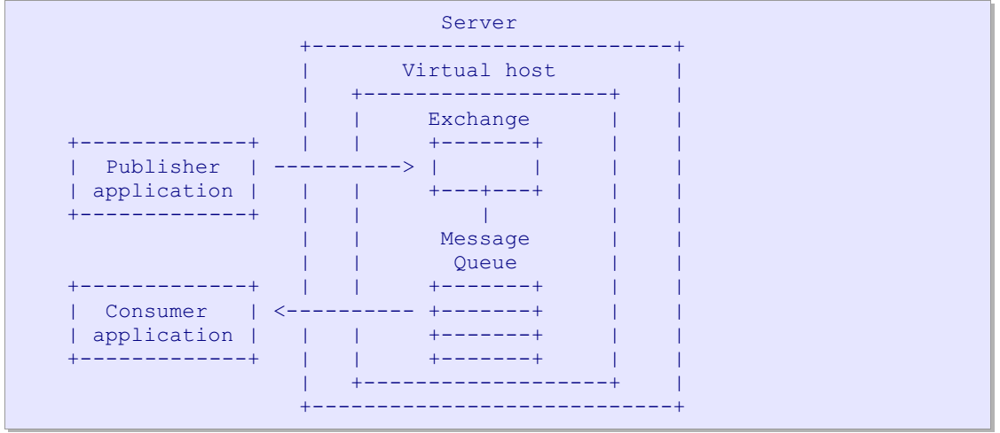

### AMQP
AMQP可以作为客户端和服务端的一个消息中间件,主要可以分为生产者,消费者,交换机(路由),消息队列几个部分组成.生产者发布消息,并可以指定特性的主题，交换机(路由)根据主题，将消息推送到对应的消息队列,消费者再从对应的消费队列中消费对应的消息.


#### 生产者
任何客户端都可以作为生产者。对所有生产者来说，消息都是发给交换机，并且由交换机路由到正确的消息队列里面去

#### 消费者
任何客户端都可以作为消费者,对消费者来说，任务就是从订阅的消息队列中获取到对应的消息

#### 交换机
交换机,接收来自生产者发布的消息,并且按照一定的规则路由到对应的消息队列中.交换机不会储存任何消息，交换价也不是单实例,可以根据需要创建不同命名的交换机，并且生产者在发布消息的时候可以指定要使用的交换机名称。交换机主要有2种:基于路由键来路由的direct 交换器类型. 默认交换器是direct交换器．基于路由模式来路由的topic 交换器类型.

##### 交换器生命周期
每个AMQP 服务器都预先创建了许多交换器(direct 和topic交换器实例).这些交换器当服务器启动时就存在了，不能被销毁. AMQP 应用程序也可以创建它们自己的交换器(declare)．应用程序可以为了私有使用而创建交换器，并在完成工作时进行销毁. AMQP提供了方法来销毁交换器，但一般来说，应用程序不会这样做.

#####  Direct交换器类型
- 消息队列使用路由键K来绑定交换器．
- 发布者使用路由键R来向交换器发送消息．
- 在Ｋ＝Ｒ时，消息会传递到消息队列中.这里是全匹配
tips:server必须实现direct交换器，并且在每个虚拟主机中必须预定义两个direct交换器: 一个名为 amq.direct, 另一个无公共名称（为Publish方法的默认交换器）.

##### Fanout 交换器类型
- 消息队列不使用参数来绑定交换器.
- 发布者向交换器发送消息.
- 消息无条件传递给消息队列。

##### Topic交换器类型
- 消息队列使用路由模式P来绑定到交换器．
- 发布者使用路由键R来向交换器发送消息．
- 当R匹配P时，消息将被传递到消息队列．
topic定义规则:  
用于topic交换器的路由键必须由０个或多个由点号
用于topic交换器的路由键必须由点分隔的零或多个单词组成.每个单词必须包含字母A-Z和a-z 以及数字0-9.
路由模式与路由键遵循相同的规则，* 用于匹配单个单词，# 用于匹配０个或多个单词.因此路由模式*.stock.# 会匹配路由键usd.stock 和eur.stock.db 但不匹配stock.nasdaq.

##### Headers交换器类型
- 消息队列使用包含匹配绑定和带有默认值的header参数表来绑定交换器.在这种交换器类型中，不使用路由键.
- 发布者向交换器发送消息，这些消息的headers属性中包含名称－值对的表.
- 如果消息头属性与队列绑定的参数相匹配，则消息传递给队列。（消息是通过http发送）
匹配算法是由参数表中的名称值对这样的特殊绑定参数来控制的. 这个参数的名称是'x-match'. 
它可以接受两种值， 以表示表格中其它的名称值对将如何来进行匹配：
'all' 则表明所有其它的名称值对必须与路由消息的头属性相匹配(即.AND匹配)
'any' 则表明只要消息头属性中的任何一个字段匹配参数表中的字段，则消息就应该被路由(即. OR匹配)．

##### System交换器类型
system交换器类型按如下方式进行工作:
- 发布者使用路由键S来向交换器发送消息．
- system交换器将其传递给系统服务S.
系统服务以*"amq."*开头，为AMQP保留使用

##### 路由键
简单来说就是充当一个url的作用,根据交换机的不同,路由键可以为不同的格式,比如对于点对点的,路由键可以为对应的消息队列的名称,对于主题订阅发布类型的路由,可以为是topic层次结构值,比如*aa.bb.cc.dd*

####  消息队列

##### 消息声明周期
- 生产者在发布消息时可以指定消息的生命周期。当消息到达服务器时,交换器通常会将消息路由到一级存在于服务器上的消息队列中.如果消息不能路由,交换器会默默地丢弃或者将其返回给生产者. 生产者可以选择如何来处理未路由消息．
- 单个消息可存在于多个消息队列. 服务器可以不同方式进行处理,如通过拷贝消息或通过引用计数器等. 这不影响互操作性。然而，当一个消息被路由到多个消息队列时，它在每个消息队列上都是一样的。没有独特的标识符来区分不同的副本。
- 当消息到达消息队列时，消息队列会通过AMQP，立即尝试将消息传递给消费者应用程序.如果不行,消息队列会存储消息(按发布者要求存储在内存或磁盘中)，并等待消费者准备好.如果没有消费者，消息队列通过AMQP将消息返回给生产者
- 当消息队列把消息投递给消费者后，它会从内部缓冲区中删除消息.这有可能立即发生，也有可能在消费者应答它已成功处理之后删除.消费者可选择如何以及何时来应答消息(设置QOS).同样地，消费者也可以拒绝消息(一个否定应答).

##### 消息队列属性
- name - 如果没有指定,服务器会选择一个名称，并将其提供给客户端.一般来说，当应用程序共享消息队列时，它们已经对消息队列名称作了事先的约定,当一个应用程序需要出于其自身目的来要求队列时，它可让服务器提供一个名称.
- exclusive - 如果设置了,队列将只属于当前连接，且在连接关闭时删除.即为一个独享队列
- durable - 如果设置了, 消息会进行存储，并在服务器重启时激活. **当服务器重启时，它可能会丢失瞬时消息**.

##### 消息队列生命周期
主要就是可持久化和临时队列
- 持久化消息队列：它们可被**多个**消费者共享，并可独立地存在 即.不管是否有消费者接收它们，它都可以继续存在收集消息．
```text 
临时消息队列创建过程

             declare
consumer   ---------> message queue
            public              exchange route to(也可跳过) 
consumer   ---------> message ----------------------------->  message queue
            cancel
consumer   ----------> delete  message queue


```

- 临时消息队列：对**某个**消费者是私有的，只能绑定此消费者.当消费者断开连接时,消息队列将被删除.