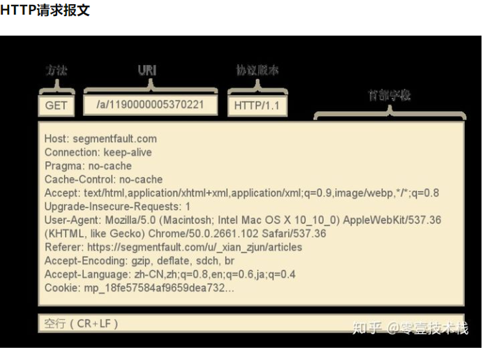
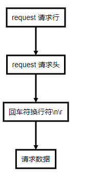
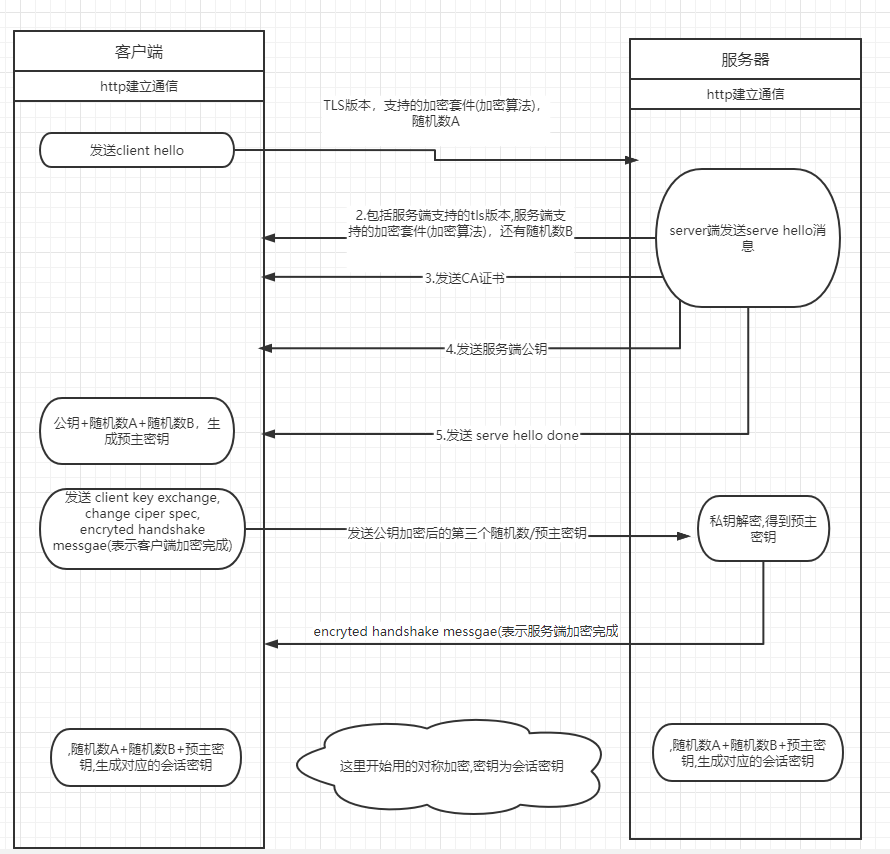

##  应用层协议.
http是位于应用层的协议,由*socket*部分我们可以知道端到端通信首先是建立一个套接字socket(TCP/UDP 链接)，建立后即可双方进行通讯，那么发送方和接收方怎么知道去解析读取到的数据呢，又怎么知道一次要读多少数据，这时就需要各种应用层协议，即socket是通讯的通道，而协议规定了消息的格式规范

## http 组成
一个http请求的组成报文如下:


### http request
http的request 报文由3部分组成.


#### 请求行
```
<请求方法>space<url>space<协议版本>回车符换行符
```

#### 请求头
```text
<key>:<value>回车符换行符
<key>:<value>回车符换行符
        ...
<key>:<value>回车符换行符

```

#### python 处理的request请求头的代码
```python

########## 解析头部
    def parse_request(self):
        """Parse a request (internal).

        The request should be stored in self.raw_requestline; the results
        are in self.command, self.path, self.request_version and
        self.headers.

        Return True for success, False for failure; on failure, any relevant
        error response has already been sent back.

        """
        ############################################## 解析request line,得到method url http version
        self.command = None  # set in case of error on the first line
        self.request_version = version = self.default_request_version
        self.close_connection = True  
        requestline = str(self.raw_requestline, 'iso-8859-1')
        requestline = requestline.rstrip('\r\n') # request line end with \r\n
        self.requestline = requestline
        words = requestline.split()
        if len(words) == 0: # <请求方法>space<url>space<协议版本>回车符换行符
            return False

        if len(words) >= 3:  # Enough to determine protocol version
            version = words[-1]
            try:
                if not version.startswith('HTTP/'):
                    raise ValueError
                base_version_number = version.split('/', 1)[1]
                version_number = base_version_number.split(".")
                # RFC 2145 section 3.1 says there can be only one "." and
                #   - major and minor numbers MUST be treated as
                #      separate integers;
                #   - HTTP/2.4 is a lower version than HTTP/2.13, which in
                #      turn is lower than HTTP/12.3;
                #   - Leading zeros MUST be ignored by recipients.
                if len(version_number) != 2:
                    raise ValueError
                version_number = int(version_number[0]), int(version_number[1])
            except (ValueError, IndexError):
                self.send_error(
                    HTTPStatus.BAD_REQUEST,
                    "Bad request version (%r)" % version)
                return False
            if version_number >= (1, 1) and self.protocol_version >= "HTTP/1.1":
                ### http 1.1 版本默认为connection为 keep-alive，此时同个域名建立的TCP链接不会关系,后面所有的请求都走的这个
                ### 链接。
                self.close_connection = False
            if version_number >= (2, 0): 
                # 暂时不支持http2.0
                self.send_error( 
                    HTTPStatus.HTTP_VERSION_NOT_SUPPORTED,
                    "Invalid HTTP version (%s)" % base_version_number)
                return False
            self.request_version = version

        if not 2 <= len(words) <= 3: 
            self.send_error(
                HTTPStatus.BAD_REQUEST,
                "Bad request syntax (%r)" % requestline)
            return False
        command, path = words[:2]
        if len(words) == 2:
            self.close_connection = True
            if command != 'GET': # http 0.9只支持 GET
                self.send_error(
                    HTTPStatus.BAD_REQUEST,
                    "Bad HTTP/0.9 request type (%r)" % command)
                return False
        self.command, self.path = command, path

        ############################################# 解析请求头 ##########################
        # Examine the headers and look for a Connection directive.
        try:
            ## 解析头部
            self.headers = http.client.parse_headers(self.rfile,
                                                     _class=self.MessageClass)
        except http.client.LineTooLong as err:
            self.send_error(
                HTTPStatus.REQUEST_HEADER_FIELDS_TOO_LARGE,
                "Line too long",
                str(err))
            return False
        except http.client.HTTPException as err:
            self.send_error(
                HTTPStatus.REQUEST_HEADER_FIELDS_TOO_LARGE,
                "Too many headers",
                str(err)
            )
            return False

        # 判断是否为 keep-alive.SERVER再决定处理完成后是否close connection
        conntype = self.headers.get('Connection', "")
        if conntype.lower() == 'close':
            self.close_connection = True
        elif (conntype.lower() == 'keep-alive' and
              self.protocol_version >= "HTTP/1.1"):
            self.close_connection = False
        # Examine the headers and look for an Expect directive
        ## expect 100-continue 主要是客户端向服务端发送数据时，如果需要先确认是否能发送，可发送
        ## expect 100-continue. 服务端收到改请求后发送一个状态为 continue的响应或者 final的响应
        ## 来决定是否要回复
        expect = self.headers.get('Expect', "")
        if (expect.lower() == "100-continue" and 
                self.protocol_version >= "HTTP/1.1" and
                self.request_version >= "HTTP/1.1"):
            if not self.handle_expect_100():
                return False
        return True

    def handle_one_request(self):
        """Handle a single HTTP request.

        You normally don't need to override this method; see the class
        __doc__ string for information on how to handle specific HTTP
        commands such as GET and POST.

        """
        try:
            ## 先读取request line 部分，直接读取整行 (遇到\r\n即为一行)(最大长度不过65337)
            self.raw_requestline = self.rfile.readline(65537)
            if len(self.raw_requestline) > 65536:
                self.requestline = ''
                self.request_version = ''
                self.command = ''
                self.send_error(HTTPStatus.REQUEST_URI_TOO_LONG)
                return
            if not self.raw_requestline:
                self.close_connection = True
                return
            if not self.parse_request():
                # An error code has been sent, just exit
                return
            mname = 'do_' + self.command
            if not hasattr(self, mname):
                self.send_error(
                    HTTPStatus.NOT_IMPLEMENTED,
                    "Unsupported method (%r)" % self.command)
                return
            method = getattr(self, mname)
            method()
            self.wfile.flush() #actually send the response if not already done.
        except socket.timeout as e:
            #a read or a write timed out.  Discard this connection
            self.log_error("Request timed out: %r", e)
            self.close_connection = True
            return

 ############# 解析 request header

 def _read_headers(fp):
    """Reads potential header lines into a list from a file pointer.

    Length of line is limited by _MAXLINE, and number of
    headers is limited by _MAXHEADERS.
    """
    headers = []
    ### 依然是读取每一行
    while True:
        line = fp.readline(_MAXLINE + 1)
        if len(line) > _MAXLINE:
            raise LineTooLong("header line")
        headers.append(line)
        if len(headers) > _MAXHEADERS:
            ## header key-value键值对不超过 100
            raise HTTPException("got more than %d headers" % _MAXHEADERS)
        if line in (b'\r\n', b'\n', b''):
            ### 根据HTTP协议，header和data之间有一行分隔符(\r\n)
            break
    return headers

def parse_headers(fp, _class=HTTPMessage):
    """Parses only RFC2822 headers from a file pointer.

    email Parser wants to see strings rather than bytes.
    But a TextIOWrapper around self.rfile would buffer too many bytes
    from the stream, bytes which we later need to read as bytes.
    So we read the correct bytes here, as bytes, for email Parser
    to parse.

    """
    ## ”key：value” 转换为字典 ()
    headers = _read_headers(fp)
    hstring = b''.join(headers).decode('iso-8859-1')
    return email.parser.Parser(_class=_class).parsestr(hstring)


```
从上面的源码可以看到，http的请求头并没有固定的长度，那么怎么知道每次要读多少字节的数据？HTTP规定每次都是去读取一行，即以`换行符[\r\n(\r)(\n)]`为分割符，为一次读取的数据,那如何知道读取多少次呢？通过每次的内容来判断，如果为为换行符，则说明header读取结束，接下来的数据为request的data部分(SimpleHTTPRequestHandle不支持REQUET GET 带BODY)


### request data解析
由上面的代码可以知道，HTTP是先解析了request line ,request header,然后再处理request data. 通过request line可以request method,然后通过调用do_{{requestMethod}}()的方式来接收数据

```python
    SimpleHTTPRequestHandler # 只实现了 GET/HEADER
    def do_GET(self):
        """Serve a GET request."""
        f = self.send_head()
        if f:
            try:
                self.copyfile(f, self.wfile)
            finally:
                f.close()

    ###  send_head()
    def send_head(self):
        """Common code for GET and HEAD commands.

        This sends the response code and MIME headers.

        Return value is either a file object (which has to be copied
        to the outputfile by the caller unless the command was HEAD,
        and must be closed by the caller under all circumstances), or
        None, in which case the caller has nothing further to do.

        """
        # 解析 url 去掉 query string
        path = self.translate_path(self.path)
        f = None
        if os.path.isdir(path):
            parts = urllib.parse.urlsplit(self.path)
            if not parts.path.endswith('/'):
                # redirect browser - doing basically what apache does
                ## 重定向,既没有以 / 结尾自动以 重定向到 XX/?XX
                self.send_response(HTTPStatus.MOVED_PERMANENTLY)
                new_parts = (parts[0], parts[1], parts[2] + '/',
                             parts[3], parts[4])
                new_url = urllib.parse.urlunsplit(new_parts)
                self.send_header("Location", new_url)
                self.end_headers()
                return None
            for index in "index.html", "index.htm":
                # URL为文件夹，请求文件夹下的 index.html文件
                index = os.path.join(path, index)
                if os.path.exists(index):
                    path = index
                    break
            else:
                # 没有index,返回文件夹列表
                return self.list_directory(path)

        ctype = self.guess_type(path)
        try:
            f = open(path, 'rb')
        except OSError:
            self.send_error(HTTPStatus.NOT_FOUND, "File not found")
            return None

        try:
            fs = os.fstat(f.fileno())
            # Use browser cache if possible
            if ("If-Modified-Since" in self.headers
                    and "If-None-Match" not in self.headers):
                # compare If-Modified-Since and time of last file modification
                try:
                    ims = email.utils.parsedate_to_datetime(
                        self.headers["If-Modified-Since"])
                except (TypeError, IndexError, OverflowError, ValueError):
                    # ignore ill-formed values
                    pass
                else:
                    if ims.tzinfo is None:
                        # obsolete format with no timezone, cf.
                        # https://tools.ietf.org/html/rfc7231#section-7.1.1.1
                        ims = ims.replace(tzinfo=datetime.timezone.utc)
                    if ims.tzinfo is datetime.timezone.utc:
                        # compare to UTC datetime of last modification
                        last_modif = datetime.datetime.fromtimestamp(
                            fs.st_mtime, datetime.timezone.utc)
                        # remove microseconds, like in If-Modified-Since
                        last_modif = last_modif.replace(microsecond=0)

                        if last_modif <= ims:
                            self.send_response(HTTPStatus.NOT_MODIFIED)
                            self.end_headers()
                            f.close()
                            return None

            self.send_response(HTTPStatus.OK)
            self.send_header("Content-type", ctype)
            self.send_header("Content-Length", str(fs[6]))
            self.send_header("Last-Modified",
                self.date_time_string(fs.st_mtime))
            self.end_headers()
            return f
        except:
            f.close()
            raise
```

#### 如何解析 post/get中的body数据
一般通过header中的“content-length”字段来读取对应长度的数据
```python

    def do_POST(self):
        content_length = int(self.headers['Content-Length']) # <--- Gets the size of data
        post_data = self.rfile.read(content_length) # <--- Gets the data itself
        logging.info("POST request,\nPath: %s\nHeaders:\n%s\n\nBody:\n%s\n",
                str(self.path), str(self.headers), post_data.decode('utf-8'))

        self._set_response()
        self.wfile.write("POST request for {}".format(self.path).encode('utf-8'))

```

### http响应报文
1个http响应的报文例子如下:


### http response

http的request 报文由3部分组成.

```flow

st=>operation:  request 响应行
middle=>operation: request 响应头   
break=>operation: 回车符换行符\n\r
op1=>operation: 响应数据
st->middle->break->op1

```
#### 响应行
```
<HTTP版本>space<状态码>space<响应提示(比如NotFind，OK)>回车符换行符
```

#### 响应头
```text
<key>:<value>回车符换行符
<key>:<value>回车符换行符
        ...
<key>:<value>回车符换行符

```


## https
http所有的东西都是明文加密的.为了数据传输的安全性,通常需要对传输的数据进行加密.现在的主流加密方式是基于SSL/TLS的加密方式,TLS是SSL3.0之后的版本的叫法,基于SSL/TLS的加密通讯端口会默认改为443.SSL/TLS的加密方式既包含对称加密,又包含非对称加密.   


### 对称加密
对称加密,主要是指双方协商指定对应的加密/解密方式,双方都用统一的密钥来加解密,比如双方统一都用Base64加解密,常见的DES，AES都是对称加密算法


### 非对称加密算法
非对称加密,是指双方拥有各自的私钥,和一个共有的公钥.客户端用私钥和公钥对发送的数据进行加密,加密后的数据只能用服务端的私钥去解开.同时服务端用用私钥和公钥对发送的数据进行加密，加密后的数据只能客户端的私钥去解开.加密过程中涉及2个密钥，公钥和私钥.
非对称加密算法的具体逻辑如下:


#### DH算法
DH即为密钥交换算法.


### tls/ssl 握手过程
tls/SSL是在http已经完成握手,通信通道建立之后再进行的一层加密，有点类似websocket,都是在HTTP的基础在进行协议的升级,TLS/SSL加密通讯通道的建立也是通过握手协议来建立，握手过程如下: 



### CA机构
- 虽然非对称加密能够保证消息加解密的安全,但是并不能保证通讯通道的安全,比如有中间者接受了客户端发送的ssl/TLS的握手请求,并且伪造了公钥和私钥.为了避免这种情况出现,必须保证链接的服务器是我们确定要链接的服务器.CA证书就是对服务器的一个认证.服务器通过向CA权威机构提交认证信息,CA权威机构认证后会给服务器颁发一个数字证书.在tls/ssl的握手阶段，客户端会把该数字证书发给客户端.
- 客户端收到ca数字证书时,客户端会利用自身内置的ca公钥进行解密.即可以验证链接的服务端是否为我们要链接的客户端
- 一般操作系统和浏览器会内置一些权威ca机构的公钥.在收到服务端的数字证书后,直接用内置的公钥进行解密,这样就可以避免
被一些中间者截获伪造CA公钥
- CA数字证书同样也是使用的非对称加密。


### 总结
 - https是对双方通讯的内容做的一层加密,采用的是非对称加密的形式.通过非对称加密可以保证双方生成一个只有双方持有的会话密钥.后续用这个密钥对传输的数据进行加密传输(走的对称加密).
 - ca证书是保证通讯通道的安全性.ca证书包含了服务端的相关信息.客户端可以根据ca证书来确定连接的服务方是不是所需要链接的服务方.
 - ca证书也是通过非对称加密来保证安全性的.客户端会内置一些权威认证机构的跟证书(公钥).用来对服务端发来的数字证书进行验证.


