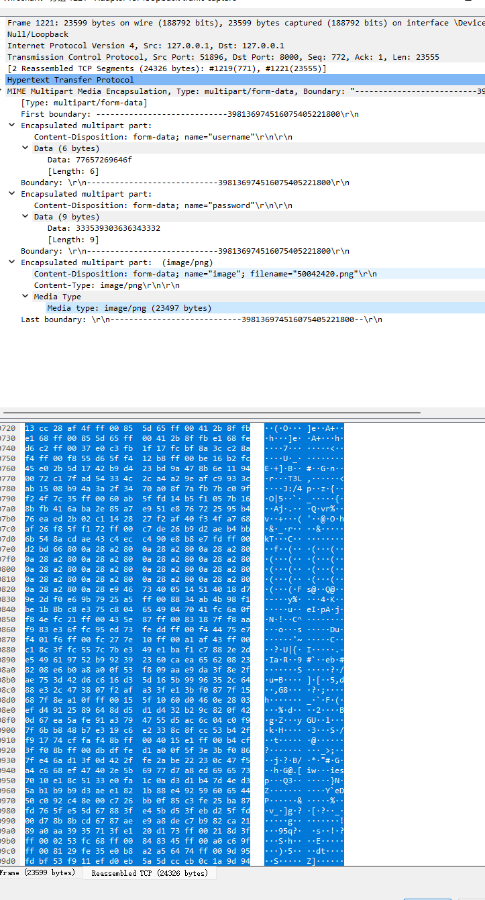
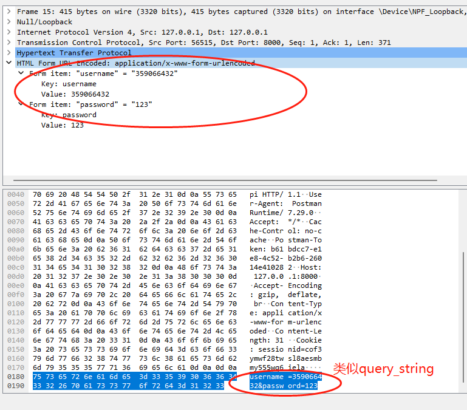
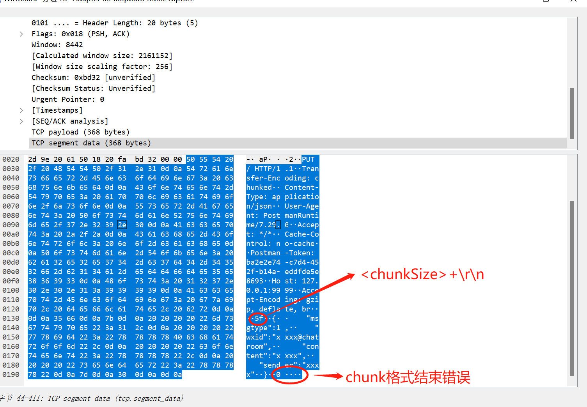

## multipart/form-data  和 application/x-www-form-urlencoded 的区别
* x-www-form-urlencoded 和 form-data 都可以用来发送表单数据。

* x-www-form-urlencoded 会把发送的内容中的非*ASCII*字符编码成3个字节的长度(URL编码)，因为二进制中的数据中的非数字字符都会被编码成3个字节,所以长度扩大了3倍，故不适合用来发送大数据和文件。图片等        
```text
//// x-www-form-urlencoded格式发送数据

key1=value1&key2=value21&key2=value22&key3=value3

```
* multipart/form-data: 不会对发送的二进制数据进行编码.同时发送的每个KEY-VALUE会按照分割符分割.都会有自己的header信息(适合发送比较大的数据):
```text

//// multipart/form-data格式发送数据

--[分隔符]
Content-Disposition: form-data; name="" \r\n\r\n
Content-Type: text/plain
[DATA]
--[分隔符]
Content-Disposition: form-data; name=""; filename="" \r\n\r\n
Content-Type:  text/plain
[DATA]
--[分隔符]
Content-Disposition: form-data; name="photo"; filename="photo.jpeg" \r\n\r\n
Content-Type: image/jpeg
[JPEG DATA]
--xyz--(最后一个分隔符,多了"--")

```

* 假设发送的表单数据为: name=John,age=2.按不同的表单格式发送,数据的格式如下:
```text
//// x-www-form-urlencoded格式发送数据
name=John&age=23


//// multipart/form-data格式发送数据 分隔符为 xyz

--xyz   \r\n
Content-Disposition: form-data; name="name" \r\n\r\n
Content-Type: text/plain

John
--xyz \r\n
Content-Disposition: form-data; name="age"  \r\n\r\n
Content-Type: text/plain

23

--xyz--

```

### 抓包验证
1.先发送一个数据格式为body为*form-data*格式的请求,用抓包工具抓取其数据格式:



可以看到其data的格式如上面所示      


2. 先发送一个数据格式为body为*application/x-www-form-urlencoded*格式的请求,用抓包工具抓取其数据格式:

         

可以看到数据格式为类似"query_string"


## content-length 和 Transfer-Encoding:chunked的区别
* 当发送的数据的长度是确定的时候.直接使用`content-length`
* 当发送的数据长度不确实时候，可以使用 `Transfer-Encoding:chunked`,此时请求头不应该使用`content-length`

### Transfer-Encoding:chunked的data数据结构
```
<chunked-length:十六进制> \r\n
chunk-data \r\n
...
0\r\n  //chunk 传递结束
\r\n 

```

```text
HTTP/1.1 200 OK
Content-Type: text/plain
Transfer-Encoding: chunked
7\r\n
Mozilla\r\n
9\r\n
Developer\r\n
7\r\n
Network\r\n
0\r\n
\r\n

```

### http服务端的一个读取数据类型为“chunk”的一个例子

```python
### HTTP处理chunk
class CustomHTTPRequestHandler(BaseHTTPRequestHandler):
    protocol_version = 'HTTP/1.1' #开启keep-alive,http要使用ThreadingHTTPServer,否则一次性只能处理一个keep-alive连接

    def do_PUT(self):
        if "Content-Length" in self.headers and "chunked" in self.headers.get("Transfer-Encoding", ""):
            raise AttributeError(">>> 请求头错误")
        if "Content-Length" in self.headers:
            content_length = int(self.headers["Content-Length"])
            body = self.rfile.read(content_length)
            print(">>>> content_length type",body)
        elif "chunked" in self.headers.get("Transfer-Encoding", ""):
            ## chunked类型要一直读取直到收到结束标记("0/r/n/r/n")
            while True: 
                line = self.rfile.readline().strip()
                chunk_length = int(line, 16)
                if chunk_length != 0:
                    chunk = self.rfile.read(chunk_length)
                    print(chunk.decode("utf-8"))
                self.rfile.readline()
                if chunk_length == 0:
                    break
        reply_response = {
            "status":HTTPStatus.OK,
            "data":{
                "msg":"success"
            }
        }
        res = json.dumps(reply_response,ensure_ascii=False).encode('utf-8')
        self.send_response(HTTPStatus.OK)
        self.send_header('Content-type', 'application/json')
        self.send_header("Content-length",len(res))
        self.end_headers()
        self.wfile.write(res)       
```

### chunk-data 传输数据抓包格式



### 补充
* 当调用`close`操作后.会马上关闭调用方的`socket-fd`.而服务方socket会进入time_wait状态.
* 当正常走的TCP四次握手断开流程，双方都会马上关闭`socket-fd`.
