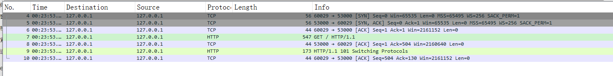
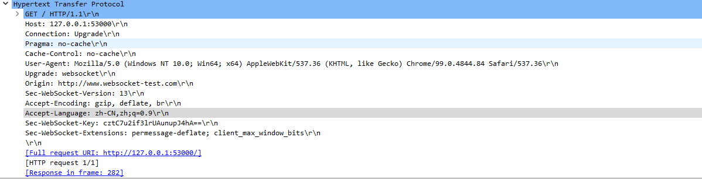
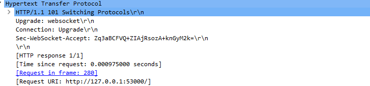
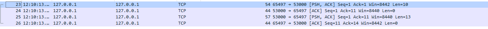
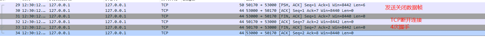
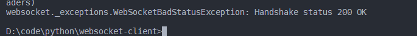
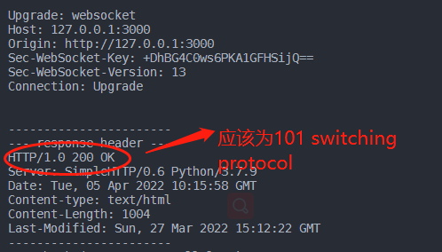

# WS协议(rfc6455)理解
## 握手阶段
ws同样是基于Http协议的，建立连接前同样要经过3次握手:

1.客户端发起请求.请求的数据格式如下:

```text 

    GET /chat HTTP/1.1              // request raw
    Host: server.example.com         
    Upgrade: websocket              // 必须有,通知服务端这一次连接是一个WS连接
    Connection: Upgrade             // 必须有,通知服务端这一次连接是一个WS连接
    Sec-WebSocket-Key: dGhlIHNhbXBsZSBub25jZQ==   //随机选择的16字节值组成，该值已进行base64编码
    Origin: http://example.com     // 主要用于防止跨域用，如果来自浏览器，会有这个请求
    Sec-WebSocket-Protocol: chat, superchat  // 可选 指示客户端希望使用哪些子协议，并按首选项排序。
    Sec-WebSocket-Version: 13 //必填

```

2.服务端响应客户端的握手请求
```text

    HTTP/1.1 101 Switching Protocols  // http response raw
    Upgrade: websocket   
    Connection: Upgrade
    Sec-WebSocket-Accept: s3pPLMBiTxaQ9kYGzzhZRbK+xOo=

```
* 这里必须注意,握手阶段返回的状态码必须为101,如果不是,都表示这个ws的握手阶段*没有完成*,一般客户端会抛出 "handshake status 200"的错误.
* 客户端收到响应后,会对*status code*,*Sec-WebSocket-Accept*进行校验.校验不通过,握手阶段将不会继续进行

### 关于 Sec-WebSocket-Protocol   
比如指定两边传送的数据都为json,以JSON格式去解析数据,则可以在*Sec-WebSocket-Protocol*中添加JSON来标记

### 握手时client的Sec-WebSocket-Key和Sec-WebSocket-Accept的Sec-WebSocket-Accept的校验
TODO

### mask
表示是否要对数据载荷进行掩码操作。从客户端向服务端发送数据时，需要对数据进行掩码操作；从服务端向客户端发送数据时，不需要对数据进行掩码操作.


### websocket数据帧
```text

+-+-+-+-+-------+-+-------------+-------------------------------+
 0                   1                   2                   3
 0 1 2 3 4 5 6 7 8 9 0 1 2 3 4 5 6 7 8 9 0 1 2 3 4 5 6 7 8 9 0 1
+-+-+-+-+-------+-+-------------+-------------------------------+
|F|R|R|R| opcode|M| Payload len |    Extended payload length    |
|I|S|S|S|  (4)  |A|     (7)     |             (16/64)           |
|N|V|V|V|       |S|             |   (if payload len==126/127)   |
| |1|2|3|       |K|             |                               |
+-+-+-+-+-------+-+-------------+ - - - - - - - - - - - - - - - +
|     Extended payload length continued, if payload len == 127  |
+ - - - - - - - - - - - - - - - +-------------------------------+
|                     Payload Data continued ...                |
+---------------------------------------------------------------+

```
- RSV1, RSV2, RSV3:
一般情况下全为0。当客户端、服务端协商采用WebSocket扩展时，这三个标志位可以非0，且值的含义由扩展进行定义。如果出现非零的值，且并没有采用WebSocket扩展，连接出错。

# WS/TCP/HTTP之间的关系
WS和HTTP都是基于TCP的的应用程协议，WS是通过HTTP发起握手的,但是在握手的HTTP的请求头中会补充协议,HTTP服务器对改请求升级为WS握手请求


# 抓包分析websocket的握手和链接建立过程

## 建立连接
先在本地起一个WS服务，然后再网页端发起一个WS连接,可以看到从建立连接的过程:


由抓取的到的数据包我们可以知道WS的握手过程:

* 1.先按照TCP协议发起3次握手并且[建立连接]('TODO'),此时只是先建立了一个TCP连接
* 2.TCP连接建立后.客户端再向服务端发送一个HTTP请求,这个HTTP请求里面包含了升级为WEBSOCKET连接的头部信息
* 3.服务端收到该HTTP请求后,将回复*101 Switching Protocols*,表示建立一个WS连接






总的来说,WS的建立过程就是一个HTTP的请求过程,并且建立连接后不会close该链接

## 发送数据
建立连接后,后续的发送数据帧的过程其实都是走的*TCP*协议,数据会被包装成对应的WS数据帧,通过TCP发送,由数据帧的格式可以知道,每个发送的数据都为额外添加3字节的数据帧信息。



数据帧的长度为 *3字节+数据编码后的字节长度*    

发送完成后,数据接收方会回应一个TCP回应数据帧.

## 关闭连接


* 关闭连接时，关闭端首先发送一个包含关闭操作码的数据帧.接着就是走TCP的关闭连接时4次握手的流程。


# 代码分析
## 服务端
由上面可以知道,WEBSOCKET的建立连接过程首先是经过TCP的3次握手,然后发送一个带有Websocket协议头部信息的HTTP请求,服务端解析这个HTTP请求后,发现这是一个WEBSOCKET长连接请求,解析通过后就建立一个双工TCP连接.
所以,WS跟普通HTTP请求不同的地方就是对带有Websocket协议头部信息的HTTP请求解析过程,在服务端要做的就是按照WS协议编写一个Request的handle方法。
```python

#  代码来自https://github.com/Pithikos/python-websocket-server
class WebSocketHandler(StreamRequestHandler):

    def __init__(self, socket, addr, server):
        self.server = server
        assert not hasattr(self, "_send_lock"), "_send_lock already exists"
        self._send_lock = threading.Lock()
        if server.key and server.cert:
            try:
                socket = ssl.wrap_socket(socket, server_side=True, certfile=server.cert, keyfile=server.key)
            except: # Not sure which exception it throws if the key/cert isn't found
                logger.warning("SSL not available (are the paths {} and {} correct for the key and cert?)".format(server.key, server.cert))
        StreamRequestHandler.__init__(self, socket, addr, server)

    def setup(self):
        StreamRequestHandler.setup(self)
        self.keep_alive = True
        self.handshake_done = False
        self.valid_client = False

    def handle(self):
        while self.keep_alive:
            if not self.handshake_done:
                self.handshake()
            elif self.valid_client:
                self.read_next_message()

    def read_bytes(self, num):
        return self.rfile.read(num)

    def read_next_message(self):
        try:
            b1, b2 = self.read_bytes(2)
        except SocketError as e:  # to be replaced with ConnectionResetError for py3
            if e.errno == errno.ECONNRESET:
                logger.info("Client closed connection.")
                self.keep_alive = 0
                return
            b1, b2 = 0, 0
        except ValueError as e:
            b1, b2 = 0, 0

        fin    = b1 & FIN
        opcode = b1 & OPCODE
        masked = b2 & MASKED
        payload_length = b2 & PAYLOAD_LEN

        if opcode == OPCODE_CLOSE_CONN:
            logger.info("Client asked to close connection.")
            self.keep_alive = 0
            return
        if not masked:
            logger.warning("Client must always be masked.")
            self.keep_alive = 0
            return
        if opcode == OPCODE_CONTINUATION:
            logger.warning("Continuation frames are not supported.")
            return
        elif opcode == OPCODE_BINARY:
            logger.warning("Binary frames are not supported.")
            return
        elif opcode == OPCODE_TEXT:
            opcode_handler = self.server._message_received_
        elif opcode == OPCODE_PING:
            opcode_handler = self.server._ping_received_
        elif opcode == OPCODE_PONG:
            opcode_handler = self.server._pong_received_
        else:
            logger.warning("Unknown opcode %#x." % opcode)
            self.keep_alive = 0
            return

        if payload_length == 126:
            payload_length = struct.unpack(">H", self.rfile.read(2))[0]
        elif payload_length == 127:
            payload_length = struct.unpack(">Q", self.rfile.read(8))[0]

        masks = self.read_bytes(4)
        message_bytes = bytearray()
        for message_byte in self.read_bytes(payload_length):
            message_byte ^= masks[len(message_bytes) % 4]
            message_bytes.append(message_byte)
        opcode_handler(self, message_bytes.decode('utf8'))

    def send_message(self, message):
        self.send_text(message)

    def send_pong(self, message):
        self.send_text(message, OPCODE_PONG)

    def send_close(self, status=CLOSE_STATUS_NORMAL, reason=DEFAULT_CLOSE_REASON):
        """
        Send CLOSE to client

        Args:
            status: Status as defined in https://datatracker.ietf.org/doc/html/rfc6455#section-7.4.1
            reason: Text with reason of closing the connection
        """
        if status < CLOSE_STATUS_NORMAL or status > 1015:
            raise Exception(f"CLOSE status must be between 1000 and 1015, got {status}")

        header = bytearray()
        payload = struct.pack('!H', status) + reason
        payload_length = len(payload)
        assert payload_length <= 125, "We only support short closing reasons at the moment"

        # Send CLOSE with status & reason
        header.append(FIN | OPCODE_CLOSE_CONN)
        header.append(payload_length)
        with self._send_lock:
            self.request.send(header + payload)

    def send_text(self, message, opcode=OPCODE_TEXT):
        """
        Important: Fragmented(=continuation) messages are not supported since
        their usage cases are limited - when we don't know the payload length.
        """

        # Validate message
        if isinstance(message, bytes):
            message = try_decode_UTF8(message)  # this is slower but ensures we have UTF-8
            if not message:
                logger.warning("Can\'t send message, message is not valid UTF-8")
                return False
        elif not isinstance(message, str):
            logger.warning('Can\'t send message, message has to be a string or bytes. Got %s' % type(message))
            return False

        header  = bytearray()
        payload = encode_to_UTF8(message)
        payload_length = len(payload)

        # Normal payload
        if payload_length <= 125:
            header.append(FIN | opcode)
            header.append(payload_length)

        # Extended payload
        elif payload_length >= 126 and payload_length <= 65535:
            header.append(FIN | opcode)
            header.append(PAYLOAD_LEN_EXT16)
            header.extend(struct.pack(">H", payload_length))

        # Huge extended payload
        elif payload_length < 18446744073709551616:
            header.append(FIN | opcode)
            header.append(PAYLOAD_LEN_EXT64)
            header.extend(struct.pack(">Q", payload_length))

        else:
            raise Exception("Message is too big. Consider breaking it into chunks.")
            return

        with self._send_lock:
            self.request.send(header + payload)

    def read_http_headers(self):
        headers = {}
        # first line should be HTTP GET
        http_get = self.rfile.readline().decode().strip()
        assert http_get.upper().startswith('GET')
        # remaining should be headers
        while True:
            header = self.rfile.readline().decode().strip()
            if not header:
                break
            head, value = header.split(':', 1)
            headers[head.lower().strip()] = value.strip()
        return headers

    def handshake(self):
        headers = self.read_http_headers()

        try:
            assert headers['upgrade'].lower() == 'websocket'
        except AssertionError:
            self.keep_alive = False
            return

        try:
            key = headers['sec-websocket-key']
        except KeyError:
            logger.warning("Client tried to connect but was missing a key")
            self.keep_alive = False
            return

        response = self.make_handshake_response(key)
        with self._send_lock:
            self.handshake_done = self.request.send(response.encode())
        self.valid_client = True
        self.server._new_client_(self)

    @classmethod
    def make_handshake_response(cls, key):
        return \
          'HTTP/1.1 101 Switching Protocols\r\n'\
          'Upgrade: websocket\r\n'              \
          'Connection: Upgrade\r\n'             \
          'Sec-WebSocket-Accept: %s\r\n'        \
          '\r\n' % cls.calculate_response_key(key)

    @classmethod
    def calculate_response_key(cls, key):
        GUID = '258EAFA5-E914-47DA-95CA-C5AB0DC85B11'
        hash = sha1(key.encode() + GUID.encode())
        response_key = b64encode(hash.digest()).strip()
        return response_key.decode('ASCII')

    def finish(self):
        self.server._client_left_(self)

```

1. header 解析的过程如下,其实就是个解析HTTP头部的过程,以及确认是否为一个WEBSOCKET连接建立请求，简单来说，WS使用的就是HTTP请求时发起的那个socket连接

```python
    ...
    def read_http_headers(self):  # 按照HTTP协议读取request的头部
        headers = {}
        # first line should be HTTP GET
        http_get = self.rfile.readline().decode().strip()
        assert http_get.upper().startswith('GET') ## 建立连接只能通过GET
        # remaining should be headers
        while True:
            header = self.rfile.readline().decode().strip()
            if not header: # 按照HTTP协议，发送完HTTP header后，会有一个 /r/n 再是数据，详情查看HTTP解析部分
                break
            head, value = header.split(':', 1)
            headers[head.lower().strip()] = value.strip()
        return headers

    def handshake(self):
        headers = self.read_http_headers() # 获取此次HTTP请求的header

        try:
            # WS建立连接请求的标记 UPGRADE = "websocket"
            assert headers['upgrade'].lower() == 'websocket' 
        except AssertionError:
            self.keep_alive = False
            return

        try:
            key = headers['sec-websocket-key']
        except KeyError:
            logger.warning("Client tried to connect but was missing a key")
            self.keep_alive = False
            return

        response = self.make_handshake_response(key)
        with self._send_lock:
            self.handshake_done = self.request.send(response.encode()) # 调用socket.send（）方法
        self.valid_client = True
        self.server._new_client_(self)

    @classmethod
    def make_handshake_response(cls, key): 
        return \
          'HTTP/1.1 101 Switching Protocols\r\n'\
          'Upgrade: websocket\r\n'              \
          'Connection: Upgrade\r\n'             \
          'Sec-WebSocket-Accept: %s\r\n'        \
          '\r\n' % cls.calculate_response_key(key)  # HTTP协议，发送请求头完成后，再发送 \r\n,详情可看HTTP部分

    @classmethod
    def calculate_response_key(cls, key): ## 根据 sec-websocket-key 散列得到对用的 KEY
        GUID = '258EAFA5-E914-47DA-95CA-C5AB0DC85B11'
        hash = sha1(key.encode() + GUID.encode())
        response_key = b64encode(hash.digest()).strip()
        return response_key.decode('ASCII')
    ... 
```

2. 解析完成后,server会调用 *handle*方法
```python 
    ...
    def handle(self):
        while self.keep_alive:
            if not self.handshake_done:
                self.handshake()
            elif self.valid_client:
                self.read_next_message()

```
这里只要不关闭连接，就是一个不断接收WS消息的过程,区别于普通的HTTP请求，这里的http请求连接建立后并没有关闭SOCKET,而是直接升级为一个WS长连接

3. 接收，解析客户端发来的WS消息

根据WS消息帧的结构,解析过程参考注释

```python


    ...
    def read_next_message(self):
        try:
            # 先读取2个字节 解析 FIN/RSV1/RSV2/RSV3/OPCODE/MASK/PAYLOAD LEN 几个信息
            b1, b2 = self.read_bytes(2)
        except SocketError as e:  # to be replaced with ConnectionResetError for py3
            if e.errno == errno.ECONNRESET:
                logger.info("Client closed connection.")
                self.keep_alive = 0
                return
            b1, b2 = 0, 0
        except ValueError as e:
            b1, b2 = 0, 0

        fin    = b1 & FIN  #  fin 10000000  
        opcode = b1 & OPCODE # OPCODE  00001111 
        masked = b2 & MASKED # MASKED 10000000  
        payload_length = b2 & PAYLOAD_LEN # PAYLOAD_LEN 01111111 

        ## 控制位判断,处理对应的类型的数据帧
        if opcode == OPCODE_CLOSE_CONN:
            logger.info("Client asked to close connection.")
            self.keep_alive = 0
            return
        if not masked:
            logger.warning("Client must always be masked.")
            self.keep_alive = 0
            return
        if opcode == OPCODE_CONTINUATION:
            logger.warning("Continuation frames are not supported.")
            return
        elif opcode == OPCODE_BINARY:
            logger.warning("Binary frames are not supported.")
            return
        elif opcode == OPCODE_TEXT:
            opcode_handler = self.server._message_received_
        elif opcode == OPCODE_PING:
            opcode_handler = self.server._ping_received_
        elif opcode == OPCODE_PONG:
            opcode_handler = self.server._pong_received_
        else:
            logger.warning("Unknown opcode %#x." % opcode)
            self.keep_alive = 0
            return

        # 读取数据帧的长度，如果数据帧的长度表示为为0--125字节，则payload length则为数据长度
        # 如果payload为126,表示接下来2个字节表示payload长度，即为数据长度为0-65535(0~0xffff)个字节
        # 如果payload为127，表示接下来的8个字节为payload长度，即为数据长度为0-18446744073709551615(0~0xffffffffffffffff)个字节,实际上要受限于其他长度限制
        # 即payload_length要麽为7bit，要么为7+16bit,要么为7+64bit
        if payload_length == 126:
            payload_length = struct.unpack(">H", self.rfile.read(2))[0]
        elif payload_length == 127:
            payload_length = struct.unpack(">Q", self.rfile.read(8))[0]

        # 读取 mask-key
        masks = self.read_bytes(4)

        message_bytes = bytearray()
        for message_byte in self.read_bytes(payload_length):
            message_byte ^= masks[len(message_bytes) % 4] # 对数据进行反掩码，还原原来的数据
            message_bytes.append(message_byte)
        opcode_handler(self, message_bytes.decode('utf8'))

```

4. 发送数据
```python
    ...
    def send_text(self, message, opcode=OPCODE_TEXT):
        """
        Important: Fragmented(=continuation) messages are not supported since
        their usage cases are limited - when we don't know the payload length.
        """

        # Validate message
        if isinstance(message, bytes):
            message = try_decode_UTF8(message)  # this is slower but ensures we have UTF-8
            if not message:
                logger.warning("Can\'t send message, message is not valid UTF-8")
                return False
        elif not isinstance(message, str):
            logger.warning('Can\'t send message, message has to be a string or bytes. Got %s' % type(message))
            return False

        header  = bytearray()
        payload = encode_to_UTF8(message)
        payload_length = len(payload)

        ## 服务端发给客户端MASK为0，不用进行掩码
        ## 根据payload的长度封装websocket 数据帧，这里默认了 FIN=1,RSV1/2/3=0,
        # Normal payload
        if payload_length <= 125:
            header.append(FIN | opcode) # fin:10000000 opcode:00000001
            header.append(payload_length)

        # Extended payload
        elif payload_length >= 126 and payload_length <= 65535:
            header.append(FIN | opcode)
            header.append(PAYLOAD_LEN_EXT16)
            header.extend(struct.pack(">H", payload_length))

        # Huge extended payload
        elif payload_length < 18446744073709551616: # 最大长度64 BIT
            header.append(FIN | opcode)
            header.append(PAYLOAD_LEN_EXT64)
            header.extend(struct.pack(">Q", payload_length))

        else:
            raise Exception("Message is too big. Consider breaking it into chunks.")
            return

        with self._send_lock:
            self.request.send(header + payload)
```

## 客户端

1.接收解析服务端发过来的数据
```python
#  代码来自 https://github.com/websocket-client/websocket-client/blob/master/websocket/_core.py

    ...
    def recv_data_frame(self, control_frame=False):
        """
        Receive data with operation code.

        If a valid ping message is received, a pong response is sent.

        Parameters
        ----------
        control_frame: bool
            a boolean flag indicating whether to return control frame
            data, defaults to False

        Returns
        -------
        frame.opcode, frame: tuple
            tuple of operation code and string(byte array) value.
        """
        while True:
            # receive frame 就是按照WS的数据帧协议的格式去接收消息
            frame = self.recv_frame()

            if (isEnabledForTrace()):
                trace("++Rcv raw: " + repr(frame.format()))
                trace("++Rcv decoded: " + frame.__str__())
            if not frame:
                # handle error:
                # 'NoneType' object has no attribute 'opcode'
                raise WebSocketProtocolException(
                    "Not a valid frame %s" % frame)

            ## 如果分块发送，根据fin 和 OPCODE 来标记
            elif frame.opcode in (ABNF.OPCODE_TEXT, ABNF.OPCODE_BINARY, ABNF.OPCODE_CONT): 
                # 如果有分片，则继续WHILE读取下一帧数据，直到fin=1,为完整的数据帧
                self.cont_frame.validate(frame)
                self.cont_frame.add(frame)

                if self.cont_frame.is_fire(frame):
                    return self.cont_frame.extract(frame)

            elif frame.opcode == ABNF.OPCODE_CLOSE:
                self.send_close()
                return frame.opcode, frame
            elif frame.opcode == ABNF.OPCODE_PING:
                if len(frame.data) < 126:
                    self.pong(frame.data)
                else:
                    raise WebSocketProtocolException(
                        "Ping message is too long")
                if control_frame:
                    return frame.opcode, frame
            elif frame.opcode == ABNF.OPCODE_PONG:
                if control_frame:
                    return frame.opcode, frame
    

    ...


```


客户端解析过程如下，主要还是根据WS的数据帧的格式去解析:

```python 
class frame_buffer:
    _HEADER_MASK_INDEX = 5
    _HEADER_LENGTH_INDEX = 6

    def __init__(self, recv_fn, skip_utf8_validation):
        self.recv = recv_fn
        self.skip_utf8_validation = skip_utf8_validation
        # Buffers over the packets from the layer beneath until desired amount
        # bytes of bytes are received.
        self.recv_buffer = []
        self.clear()
        self.lock = Lock()

    def clear(self):
        self.header = None
        self.length = None
        self.mask = None

    def has_received_header(self) -> bool:
        return self.header is None

    def recv_header(self): # 读取前2个字节的数据并按照WS协议解析
        header = self.recv_strict(2) 
        b1 = header[0]
        fin = b1 >> 7 & 1
        rsv1 = b1 >> 6 & 1
        rsv2 = b1 >> 5 & 1
        rsv3 = b1 >> 4 & 1
        opcode = b1 & 0xf
        b2 = header[1]
        has_mask = b2 >> 7 & 1
        length_bits = b2 & 0x7f # 长度标记

        self.header = (fin, rsv1, rsv2, rsv3, opcode, has_mask, length_bits)

    def has_mask(self):
        if not self.header:
            return False
        return self.header[frame_buffer._HEADER_MASK_INDEX]

    def has_received_length(self) -> bool:
        return self.length is None

    def recv_length(self): # 根据payload bit 获取数据帧的长度
        bits = self.header[frame_buffer._HEADER_LENGTH_INDEX]
        length_bits = bits & 0x7f
        if length_bits == 0x7e:  #126 7+16 BIT
            v = self.recv_strict(2)
            self.length = struct.unpack("!H", v)[0]
        elif length_bits == 0x7f: # 127 7+64 BIT 
            v = self.recv_strict(8)
            self.length = struct.unpack("!Q", v)[0]
        else:
            self.length = length_bits

    def has_received_mask(self) -> bool:
        return self.mask is None

    def recv_mask(self): # MAKE-KEY  4 BYTES
        self.mask = self.recv_strict(4) if self.has_mask() else ""

    def recv_frame(self):

        with self.lock:
            # Header
            if self.has_received_header():
                self.recv_header()
            (fin, rsv1, rsv2, rsv3, opcode, has_mask, _) = self.header

            # Frame length
            if self.has_received_length():
                self.recv_length()
            length = self.length

            # Mask
            if self.has_received_mask():
                self.recv_mask()
            mask = self.mask

            # Payload
            payload = self.recv_strict(length)
            if has_mask:
                payload = ABNF.mask(mask, payload)

            # Reset for next frame
            self.clear()

            frame = ABNF(fin, rsv1, rsv2, rsv3, opcode, has_mask, payload)
            frame.validate(self.skip_utf8_validation)

        return frame

    def recv_strict(self, bufsize: int) -> bytes:
        shortage = bufsize - sum(map(len, self.recv_buffer))
        while shortage > 0:
            # Limit buffer size that we pass to socket.recv() to avoid
            # fragmenting the heap -- the number of bytes recv() actually
            # reads is limited by socket buffer and is relatively small,
            # yet passing large numbers repeatedly causes lots of large
            # buffers allocated and then shrunk, which results in
            # fragmentation.
            bytes_ = self.recv(min(16384, shortage))
            self.recv_buffer.append(bytes_)
            shortage -= len(bytes_)

        unified = b"".join(self.recv_buffer)

        if shortage == 0:
            self.recv_buffer = []
            return unified
        else:
            self.recv_buffer = [unified[bufsize:]]
            return unified[:bufsize]


```


# 其他

### handshake 200 的错误
主要是握手完成后,客户端发送建立连接的HTTP请求后，服务端没有按照WS协议返回101，而是直接返回200，一般是服务端没有WS的服务，直接当成HTTP服务处理了         




