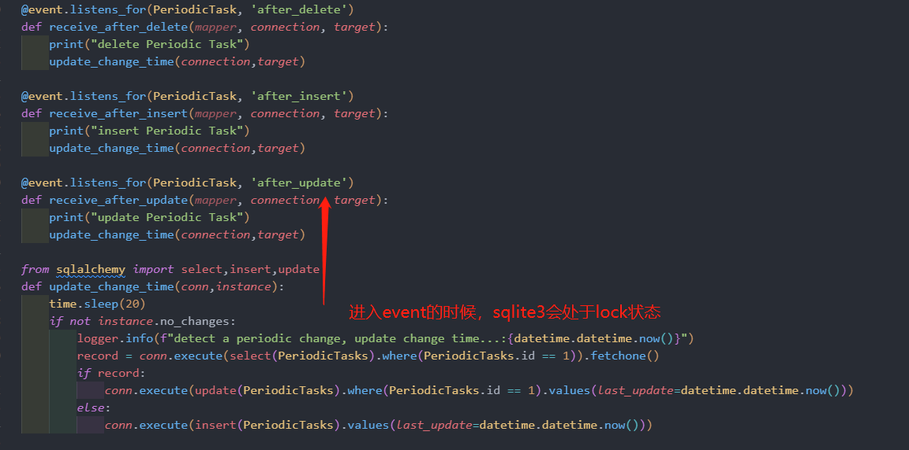

## session
当需要进行数据库的操作,**sqlalchemy**需要通过**DBAPI**与数据库建立链接.session可以看作这个connection的代理,sqlalchemy的增删改查都通过**session**来完成。

- identity_map
session.identity_map存放所有orm对象,当进行add操作,并且**commit()**完成后,identity_map**只会保留最近调用的add的传入条目**,比如调用了两次add(record),则只会cache第二次add()传入的record（第一次会被生成对应的sql语句,并从map中移除,但此时还没执行）,query的情况下也一样，只会保留最近query的一次结果


## orm对象的状态
当我们把一个实例化了一个ORM对象,并且对其增删改查操作，其状态可分为以下四种:
- 1. 临时状态(transient):即该实例还没有添加到session里面.此时该实例还没有数据库自增的id
- 2. 挂起状态(pending):当调用了session.add()方法,把该实例添加到session中时的状态,此时仍让没有同步到数据库,也不会有自增id
- 3. 持久化(persistent):当该实例被持久化到数据库后的状态,即调用了flush后,或者从数据库query出来的数据。
- 4. 删除(deleted):当删除了一个对象，并且session已经flush.(但transaction仍未完成)时的状态，当transaction完成后，状态变成了**detached**状态,当session rollback后变成了**persistent** 状态
- 5. 分离(Detached):当前对象在数据库中有对应的记录，但不存在任何session中的状态。此时该实例拥有数据库对应的自增ID


## session.expunge(orm)
session.expunge可以将persistent状态的实例移出session,并且使其状态为**detached**,或者将**pending**状态的改为**transient**状态

## Refreshing / Expiring
session.expire()/refresh()会把session中的所有orm对象设置为过期,当下次访问时,会执行对应的sql从数据库中拿到最新的数据。一般用于从数据库中强行刷新数据。

## flush/commit
session.flush()会把session中的orm对象生成对应SQL,但此时并持久化到数据库，但是会生成对应的自增ID,flush时commit的一部分

## Instance is not bound to a Session错误
对应sqlalchemy来说,instance的属性采取的懒加载的方式,即当访问**新建/插入/查询**新纪录的属性时,才会从数据库去查询对应的属性,这种特性决定每个instance实例必须和一个session绑定在一起.当访问一个未跟session绑定的instance中的某些还没加载的属性时，就会提示**Instance is not bound to a Session**的错误。

- 因为flush/commit instance时会instance对应的所有字段设置为过期字段,所以当session释放后,再次访问这个instance中的属性时(比如在另外一个函数中访问).会出现这个错.例如：

```python
def create_task():
    tasks=_create() # 拿到 tasks。但是由于session已经被释放,tasks处于未绑定session的状态，此时再去访问其中的属性，
                    # 会再调用session去从数据库查询对应的属性，就会报 not bound to session的错误
    print(tasks.name) 
    return "ok"


def _create():
    session = SessionFactory()
    # session.expire_on_commit=False
    schedule = session.query(IntervalSchedule).filter_by(every=1,period=IntervalSchedule.SECONDS).first()
    if not schedule:
        schedule = IntervalSchedule(
            every=1,period=IntervalSchedule.SECONDS
        )
        session.add(schedule)
        # session.flush()
    tasks=PeriodicTask(
        interval_id=schedule.id,      # we created this above.
        name='TestTask1-232',          # simply describes this periodic task.
        task='core.celery.test_task',  # name of task.
        args=json.dumps([8]),
    )
    session.add(tasks)
    session.commit() # commit之后，tasks所有字段会被设置为expired 

    return tasks

```
解决该方法可以参考[官方文档](https://docs.sqlalchemy.org/en/14/errors.html#error-bhk3),简单来说就是如果要在commit之后再其他地方访问,可以不要关闭销毁session,或者将session.session.expire_on_commit设置为false,或者把要访问提前预加载一下,比如在session里面先访问下所有的属性

## session的线程安全问题
sqlalchemy的只能在同一个线程里面创建并使用,不能在跨线程使用.

```python

if __name__=="__main__":
    import  threading
    session = SessionFactory()
    def target(session): # 在线程运用另外一个线程创建的session
        task = session.query(PeriodicTask).get(2)
        if task:
            session.delete(task)
            session.commit()        
    t = threading.Thread(target=target,args=(session,))
    t.start()
    t.join()


>>> 运行，会报线程错误

Traceback (most recent call last):
  File "d:\code\python\site\werido-site-backend\venv\lib\site-packages\sqlalchemy\pool\base.py", line 739, in _finalize_fairy
    fairy._reset(pool)
  File "d:\code\python\site\werido-site-backend\venv\lib\site-packages\sqlalchemy\pool\base.py", line 988, in _reset
    pool._dialect.do_rollback(self)
  File "d:\code\python\site\werido-site-backend\venv\lib\site-packages\sqlalchemy\engine\default.py", line 682, in do_rollback
    dbapi_connection.rollback()
sqlite3.ProgrammingError: SQLite objects created in a thread can only be used in that same thread. The object was created in thread id 94636 and this is thread id 117300.

During handling of the above exception, another exception occurred:

Traceback (most recent call last):
  File "d:\code\python\site\werido-site-backend\venv\lib\site-packages\sqlalchemy\pool\base.py", line 247, in _close_connection
    self._dialect.do_close(connection)
  File "d:\code\python\site\werido-site-backend\venv\lib\site-packages\sqlalchemy\engine\default.py", line 688, in do_close
    dbapi_connection.close()
sqlite3.ProgrammingError: SQLite objects created in a thread can only be used in that same thread. The object was created in thread id 94636 and this is thread id 117300.


```


## sqlite3:database is lock
当对sqlite进行写入操作时,会把整个数据库锁住。对于sqlalchemy来说,当使用update或insert操作时,会启动一个事务,获取一个排他锁,sqlite会处于lock状态.

- 使用sqlalchemy的event时,此时sqlite3会处于lock状态,此时**其他conn**不能再对该数据库执行其他操作.


