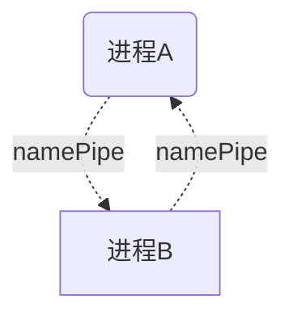
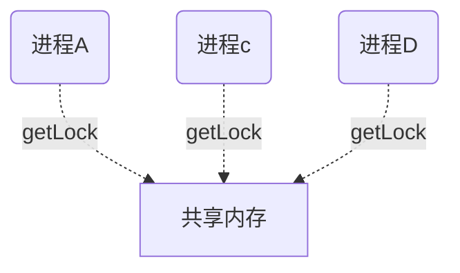

### 进程间的通信主要分为以下几种

#### 1.匿名管道
- 可以把匿名管道理解一种特殊的文件.存在于内存中,因为是匿名的，所以只适用与`父/子进程`,同时管道的数据传输是`单向流程`，要么从主进程向子进程,或者从子进程向主进程.     
- 在python中,可以通过`subprocess.PIPE`为子进程指定管道. 

```python
## main.py
import subprocess
import os,sys

child_path = os.path.join(os.path.dirname(__file__),"subp1.py")
child = subprocess.Popen(
    args=[sys.executable,child_path],
    stdout=subprocess.PIPE,
    stderr=subprocess.PIPE,
    stdin=subprocess.PIPE
)

print(child.communicate()) # 这是个阻塞状态，等到进程运行结束后才会返回输出

## subp1.py
import time
for i in range(10000):
    print("now index",i)
    # time.sleep(1)
time.sleep(10)

```


```mermaid
graph TB
    A(主进程A) -. subprocess.PIPE  stdin.-> B[子进程]
    B[子进程] -.  subprocess.PIPE  stdout  .-> A(主进程A)

```


#### 2. 非匿名管道
- 命名管道可以在`非父子`进程中使用,两个进程只需要通过管道的名称来指定到同一个管道即可
- 命名的管道命名格式为`'\\.\pipe\{{mypipename}}'`
- 主进程创建管道后,必须等到有其他进程连接到管道的另外一端,才能正常的进行数据的传输.

```python
## 进程A.py
count=0

pipe = _winapi.CreateNamedPipe(
    r'\\.\pipe\mypipename', ## 创建一个命名管道,其他进程可以通过这个名称连接到该管道
    _winapi.PIPE_ACCESS_DUPLEX,
    _winapi.PIPE_TYPE_MESSAGE | _winapi.PIPE_READMODE_MESSAGE | _winapi.PIPE_WAIT,
    1, 65536, 65536,
    0,0)
try:
    _winapi.ConnectNamedPipe(pipe, 0) # 命名管道必须等到客户端连接了才能写入
    print("got client")
    while count < 10:
        print(f"writing message {count}")
        # convert to bytes
        some_data = str.encode(f"{count}")
        _winapi.WriteFile(pipe, some_data)
        time.sleep(1)
        count += 1

    print("finished now")
finally:
    _winapi.CloseHandle(pipe)


## 进程B.py
import _winapi
while True:
    handle = _winapi.CreateFile(
        r'\\.\pipe\mypipename',
        _winapi.GENERIC_READ | _winapi.GENERIC_WRITE,
        0,
        0,
        _winapi.OPEN_EXISTING,
        0,
        0
    ) ## 通过name连接到主进程创建的命名管道.

    # 设置该管道的模式为消息模式 
    res = _winapi.SetNamedPipeHandleState(handle, _winapi.PIPE_READMODE_MESSAGE, None, None)
    if res == 0:
        print(f"SetNamedPipeHandleState return code: {res}")
    while True:
        resp = _winapi.ReadFile(handle, 64*1024)
        print(f"message: {resp}")


```



#### 3 共享内存
共享内存指在多个进程的各自共享的内存之外再额外创建一片公共的区域.可以通过名称来指定到同一个共享内存区.      
- 共享内存必须指定到具体的大小,且只能共享一些可序列化的信息.    
- 共享内存可以被多个进程同时访问
- 共享内存存在数据安全问题  
- 共享内存的最小单位时一页的大小，比如4096KB

```python 

## main.py


from multiprocessing import shared_memory

share = shared_memory.SharedMemory(name="share",size=4096,create=True)
content="共享内容".encode()
print(content.__len__())
share.buf[:content.__len__()]=content
while True:
    time.sleep(1)

### child.py
from multiprocessing import shared_memory
import mmap
exist_share = shared_memory.SharedMemory(name="share")
import array

print(array.array('L', exist_share.buf[:12])) ## 要注意每个字符串占4个字节

```




####