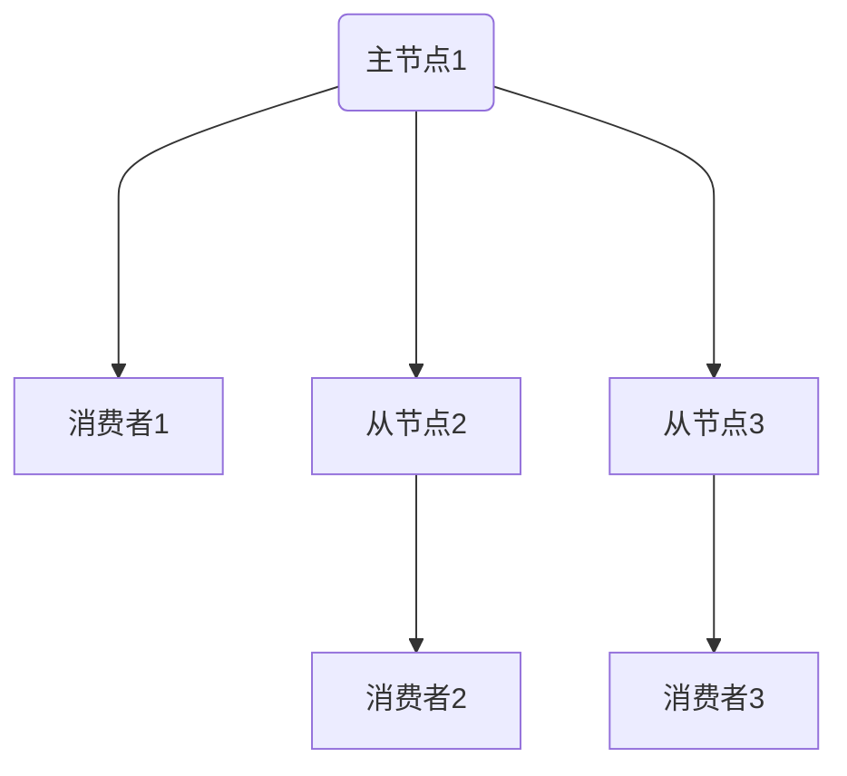

### rabbitMq的集群模式主要有3种模式

- 主备模式      
区别于数据库的主从节点,从节点相当于主节点的备份副本，但是要注意，从节点只会保存一些除了消息之外的一些元数据，所有从节点收到的请求，真实转向的都是主节点，一般在并发和数据不是特别多的情况下使用，当主节点挂掉会从备份的节点中选择一个节点出来作为主节点对外提供服务。所有的读写操作都在主节点上面。

```mermaid
graph TB

    A(主节点1) ----> F[消费者1]
    A(主节点1) ----> B[从节点2] ---> M[消费者2]
    A(主节点1) ----> C[从节点3] ---> N[消费者3]

```