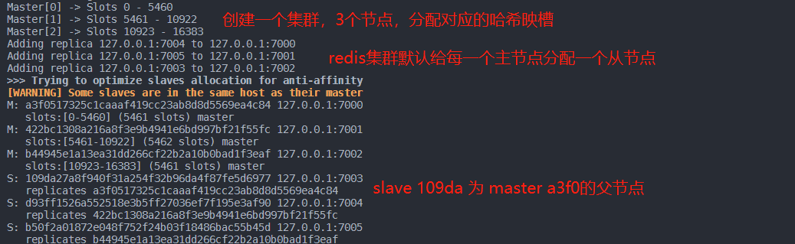
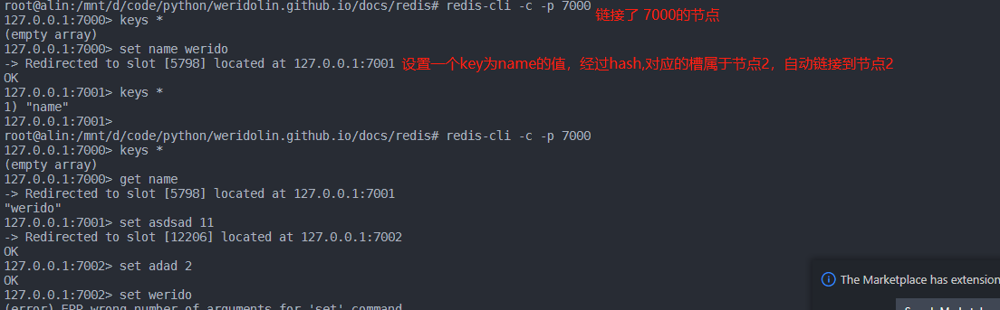

#### redis cluster不支持多数据库
当使用单个redis节点时，支持多个数据库,但当以集群部署时,不支持多个数据库,即只支持**database0**,**SELECT**命令会失效


#### redis 集群映射算法
redis集群理论上的映射范围为0--16384,节点的映射算法为:**HASH_SLOT = CRC16(key) mod 16384**,比如一个有三个节点的redis集群**1.127.0.0.1:7000 2.127.0.0.1:7001 3.127.0.0.1:7002**,则对应key的映射范围:**7000:0-5500**,**7001:5501-11000**,**7002:11001-16384**.假设输入了一个key.经过*HASH_SLOT*映射后落在**5501-11000**范围,则会对应分配使用7001节点。



#### redis使用
redis集群中每个主节点都保存有其他节点的信息,当链接了节点1,并且设置了一个key,如果key经过hash后所属的槽不属于节点1,则会自动链接到对应的节点。


#### 加入新节点
redis-cluster增加节点分为2步.
- 1.启动要加入的redis服务节点
- 2.进入集群的任意节点,往集群中添加一个节点.(此时还没有分配槽,需要进行数据迁移)

- 3.对当前的所有节点做一个数据迁移 #TODO
`redis-cli --cluster reshard  new-node`
```
redis-cli --cluster reshard 7923269e66bd5ec4bef4d83e4d217897f0c13233 
>> How many slots do you want to move (from 1 to 16384)? 2048（想要移动的槽的数量）
>> What is the receiving node ID? 7923269e66bd5ec4bef4d83e4d217897f0c13233 (新建的节点)
>>  Please enter all the source node IDs.
    Type 'all' to use all the nodes as source nodes for the hash slots.
    Type 'done' once you entered all the source nodes IDs.
    Source node #1: 5bdaafe57b1c46f61c5910d3822633a516feb4ae (要转义的槽来自的节点)
    Source node #2: done

## 重新查看集群信息
redis-cli --cluster check 127.0.0.1:7000

>>> 
M: 2bae27083d6a687956b9e270b9c5373a752b5db1 127.0.0.1:7000
   slots:[0-5460] (5461 slots) master
   1 additional replica(s)
M: 7923269e66bd5ec4bef4d83e4d217897f0c13233 127.0.0.1:7006
   slots:[5461-7508] (2048 slots) master
M: 9cb2ccfc16c314358e048e517abc70b458b05862 127.0.0.1:7001
   slots:[7509-10922] (3414 slots) master
   1 additional replica(s)
M: 0538ea6797101820dd9e63af8f1033e8d08e3b57 127.0.0.1:7002
   slots:[10923-16383] (5461 slots) master
   1 additional replica(s)
S: 9c53e90b59fe95fb29b3d43446cdc70de3976dd2 127.0.0.1:7004
   slots: (0 slots) slave
   replicates 2bae27083d6a687956b9e270b9c5373a752b5db1
S: 25226703a46ece42bbc52849f2aa1c2a5d89dc31 127.0.0.1:7005
   slots: (0 slots) slave
   replicates 9cb2ccfc16c314358e048e517abc70b458b05862
S: 8da115e63a1dc8161ffd184ea36abe7a840c484e 127.0.0.1:7003
   slots: (0 slots) slave
   replicates 0538ea6797101820dd9e63af8f1033e8d08e3b57

## 发现新加入的节点 127.0.0.1:7006 已经有从节点 127.0.0.1:7000迁移过来的2048个槽


```

##### 平衡集群各个节点的slots数量
``redis-cli --cluster rebalance --cluster-threshold 1 集群任意节点``

```text

## 平衡下刚刚集群各个节点的slots数量
redis-cli --cluster rebalance --cluster-threshold 1 127.0.0.1:7000


>>> Performing Cluster Check (using node 127.0.0.1:7000)
[OK] All nodes agree about slots configuration.
>>> Check for open slots...
>>> Check slots coverage...
[OK] All 16384 slots covered.
>>> Rebalancing across 4 nodes. Total weight = 4.00
Moving 1365 slots from 127.0.0.1:7002 to 127.0.0.1:7006
#####################################################################################################################################################################################################################################################################################################################################################################################################################################################################################################################################################################################################################################################################################################################################################################################################################################################################################################################################################################################################################################################################################################################################################################################################################################################################################################################################################################################################################
Moving 683 slots from 127.0.0.1:7000 to 127.0.0.1:7006
###########################################################################################################################################################################################################################################################################################################################################################################################################################################################################################################################################################################################################################################################################################################
Moving 682 slots from 127.0.0.1:7000 to 127.0.0.1:7001
##########################################################################################################################################################################################################################################################################################################################################################################################################################################################################################################################################################################################################################################################################################################


## 检查集群各个节点的slots数量
root@alin:/mnt/d/code/python/weridolin.github.io/docs/redis# redis-cli --cluster  check 127.0.0.1:7000
127.0.0.1:7000 (2bae2708...) -> 0 keys | 4096 slots | 1 slaves.
127.0.0.1:7006 (7923269e...) -> 0 keys | 4096 slots | 0 slaves.
127.0.0.1:7001 (9cb2ccfc...) -> 0 keys | 4096 slots | 1 slaves.
127.0.0.1:7002 (0538ea67...) -> 0 keys | 4096 slots | 1 slaves.
[OK] 0 keys in 4 masters.
0.00 keys per slot on average.
>>> Performing Cluster Check (using node 127.0.0.1:7000)
M: 2bae27083d6a687956b9e270b9c5373a752b5db1 127.0.0.1:7000
   slots:[1365-5460] (4096 slots) master
   1 additional replica(s)
M: 7923269e66bd5ec4bef4d83e4d217897f0c13233 127.0.0.1:7006
   slots:[0-682],[5461-7508],[10923-12287] (4096 slots) master
M: 9cb2ccfc16c314358e048e517abc70b458b05862 127.0.0.1:7001
   slots:[683-1364],[7509-10922] (4096 slots) master
   1 additional replica(s)
M: 0538ea6797101820dd9e63af8f1033e8d08e3b57 127.0.0.1:7002
   slots:[12288-16383] (4096 slots) master
   1 additional replica(s)
S: 9c53e90b59fe95fb29b3d43446cdc70de3976dd2 127.0.0.1:7004
   slots: (0 slots) slave
   replicates 2bae27083d6a687956b9e270b9c5373a752b5db1
S: 25226703a46ece42bbc52849f2aa1c2a5d89dc31 127.0.0.1:7005
   slots: (0 slots) slave
   replicates 9cb2ccfc16c314358e048e517abc70b458b05862
S: 8da115e63a1dc8161ffd184ea36abe7a840c484e 127.0.0.1:7003
   slots: (0 slots) slave
   replicates 0538ea6797101820dd9e63af8f1033e8d08e3b57

```