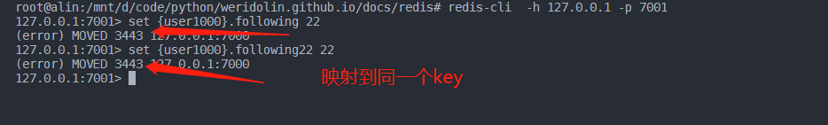
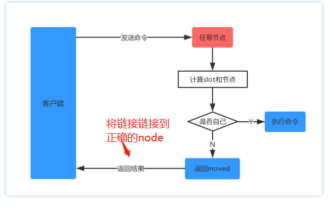
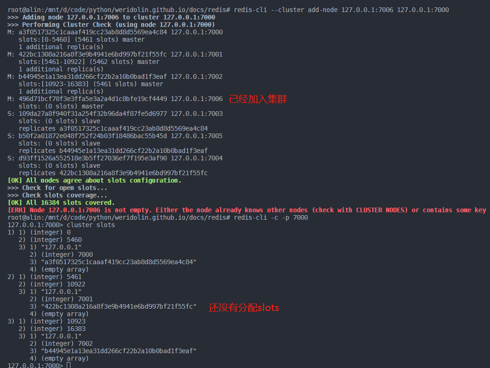

#### redis cluster不支持多数据库
当使用单个redis节点时，支持多个数据库,但当以集群部署时,不支持多个数据库,即只支持**database0**,**SELECT**命令会失效


#### redis 集群哈希槽映射算法
redis集群理论上key的哈希槽映射范围为0--16384,节点的映射算法为:**HASH_SLOT = CRC16(key) mod 16384**,比如一个有三个节点的redis集群**1.127.0.0.1:7000 2.127.0.0.1:7001 3.127.0.0.1:7002**,则对应key的映射范围:**7000:0-5500**,**7001:5501-11000**,**7002:11001-16384**.假设输入了一个key.经过*HASH_SLOT*映射后落在**5501-11000**范围,则会对应分配使用7001节点。


##### redis key的命名对哈希的影响
针对不同命名的key,redis进行key哈希的范围也不同,如果一个KEY种含有花括号 ``{}``,并且``{}``中含有1个或者多个字符,则redis只会对``{}``中的字符进行哈希映射.比如:
-  {user1000}.following and {user1000}.followers 会被哈希映射到同一个slot,因为只会对**user1000**进行映射
- foo{}{bar}/{}foo:整个key都会被hash，因为第一个 ``{}``没有内容
- foo{{bar}}zap:只会对 **{bar**进行hash,因为处于第一个``{}``
- foo{bar}{zap}:只会对 **bar**进行hash,因为处于第一个``{}``
hashTag能够使得相关的数据分布到相同的槽上面,比如:
姓名key：Person:Name:{20180890310921230001}
性别key：Person:Age:{20180890310921230001}


#### Redis Cluster Bus
redis集群中每个节点都对其他节点建立有一个持久化的tcp链接.通过TCP总线**Redis Cluster Bus**链接.当集群中的状态发生改变时,通过**Redis Cluster Bus**两两进行同步.包括：
1.数据分片（slot）和节点的对应关系
2.集群中每个节点状态；
3.集群结构发生变更同步。
4.publish/subscribe（发布订阅）功能，在Cluster版内部实现所需要交互的信息。
redis cluster是一个去中心化的方案,即每个节点都保存有整个集群状态的信息,集群中的每2个节点都通过Redis Cluster Bus发送PING/PONG来更新节点信息

#### redis Cluster 中的ping/pong(heartbeat)信息
redis集群中的两两节点通过发送ping/pong消息来进行集群状态的同步. ping/pong拥有相同的消息结构.
- 一般节点发送了ping节点后,接收节点会回复一个pong消息。节点也可以只发送pong消息来进行节点配置信息的同步
- 通常来说每秒钟会随机ping几个节点，这样，每个节点发送的ping包(和接收的pong包)的总数是一个恒定的数量，与集群中节点的数量无关。
- 如果节点发送了ping包后,在NODE_TIMEOUT/2没有响应的话，会再次像另外一个节点重新建立链接,避免是TCP链接的问题而非节点的宕机问题
- heartbeat消息包拥有相同的消息头部,包括的字段如下:
a.node_id：节点id
b.currentEpoch:集群配置版本信息
c.node flag：标记该节点是主节点还是副节点
d.hash slots map:key对应的哈希槽分布
e.master-node-id:如果是副节点，会发送主节点的NODE-ID
f:state:发送节点中记录的集群的状态


#### Redis Cluster 路由
因为redis集群没有代理功能,当设置的key对应的hash槽不在当前链接的节点时，**Redis Cluster Bus**会返回一个**MOVE**，指令,并告知正确节点,此时客户端会重新路由到正确的节点。


#### redis集群使用
redis集群中每个主节点都保存有其他节点的信息,当链接了节点1,并且设置了一个key,如果key经过hash后所属的槽不属于节点1,会向客户端返回一个MOVE指令,客户端会自动链接到对应的节点。




#### 加入新节点
redis-cluster增加节点分为2步.
- 1.启动要加入的redis服务节点
- 2.进入集群的任意节点,往集群中添加一个节点.(此时还没有分配槽,需要进行数据迁移)

- 3.对当前的所有节点做一个数据迁移 #TODO
`redis-cli --cluster reshard  new-node`
```
redis-cli --cluster reshard 7923269e66bd5ec4bef4d83e4d217897f0c13233 
>> How many slots do you want to move (from 1 to 16384)? 2048（想要移动的槽的数量）
>> What is the receiving node ID? 7923269e66bd5ec4bef4d83e4d217897f0c13233 (新建的节点)
>>  Please enter all the source node IDs.
    Type 'all' to use all the nodes as source nodes for the hash slots.
    Type 'done' once you entered all the source nodes IDs.
    Source node #1: 5bdaafe57b1c46f61c5910d3822633a516feb4ae (要转义的槽来自的节点)
    Source node #2: done

## 重新查看集群信息
redis-cli --cluster check 127.0.0.1:7000

>>> 
M: 2bae27083d6a687956b9e270b9c5373a752b5db1 127.0.0.1:7000
   slots:[0-5460] (5461 slots) master
   1 additional replica(s)
M: 7923269e66bd5ec4bef4d83e4d217897f0c13233 127.0.0.1:7006
   slots:[5461-7508] (2048 slots) master
M: 9cb2ccfc16c314358e048e517abc70b458b05862 127.0.0.1:7001
   slots:[7509-10922] (3414 slots) master
   1 additional replica(s)
M: 0538ea6797101820dd9e63af8f1033e8d08e3b57 127.0.0.1:7002
   slots:[10923-16383] (5461 slots) master
   1 additional replica(s)
S: 9c53e90b59fe95fb29b3d43446cdc70de3976dd2 127.0.0.1:7004
   slots: (0 slots) slave
   replicates 2bae27083d6a687956b9e270b9c5373a752b5db1
S: 25226703a46ece42bbc52849f2aa1c2a5d89dc31 127.0.0.1:7005
   slots: (0 slots) slave
   replicates 9cb2ccfc16c314358e048e517abc70b458b05862
S: 8da115e63a1dc8161ffd184ea36abe7a840c484e 127.0.0.1:7003
   slots: (0 slots) slave
   replicates 0538ea6797101820dd9e63af8f1033e8d08e3b57

## 发现新加入的节点 127.0.0.1:7006 已经有从节点 127.0.0.1:7000迁移过来的2048个槽


```

##### 平衡集群各个节点的slots数量
``redis-cli --cluster rebalance --cluster-threshold 1 集群任意节点``

```text

## 平衡下刚刚集群各个节点的slots数量
redis-cli --cluster rebalance --cluster-threshold 1 127.0.0.1:7000


>>> Performing Cluster Check (using node 127.0.0.1:7000)
[OK] All nodes agree about slots configuration.
>>> Check for open slots...
>>> Check slots coverage...
[OK] All 16384 slots covered.
>>> Rebalancing across 4 nodes. Total weight = 4.00
Moving 1365 slots from 127.0.0.1:7002 to 127.0.0.1:7006
#####################################################################################################################################################################################################################################################################################################################################################################################################################################################################################################################################################################################################################################################################################################################################################################################################################################################################################################################################################################################################################################################################################################################################################################################################################################################################################################################################################################################################################
Moving 683 slots from 127.0.0.1:7000 to 127.0.0.1:7006
###########################################################################################################################################################################################################################################################################################################################################################################################################################################################################################################################################################################################################################################################################################################
Moving 682 slots from 127.0.0.1:7000 to 127.0.0.1:7001
##########################################################################################################################################################################################################################################################################################################################################################################################################################################################################################################################################################################################################################################################################################################


## 检查集群各个节点的slots数量
root@alin:/mnt/d/code/python/weridolin.github.io/docs/redis# redis-cli --cluster  check 127.0.0.1:7000
127.0.0.1:7000 (2bae2708...) -> 0 keys | 4096 slots | 1 slaves.
127.0.0.1:7006 (7923269e...) -> 0 keys | 4096 slots | 0 slaves.
127.0.0.1:7001 (9cb2ccfc...) -> 0 keys | 4096 slots | 1 slaves.
127.0.0.1:7002 (0538ea67...) -> 0 keys | 4096 slots | 1 slaves.
[OK] 0 keys in 4 masters.
0.00 keys per slot on average.
>>> Performing Cluster Check (using node 127.0.0.1:7000)
M: 2bae27083d6a687956b9e270b9c5373a752b5db1 127.0.0.1:7000
   slots:[1365-5460] (4096 slots) master
   1 additional replica(s)
M: 7923269e66bd5ec4bef4d83e4d217897f0c13233 127.0.0.1:7006
   slots:[0-682],[5461-7508],[10923-12287] (4096 slots) master
M: 9cb2ccfc16c314358e048e517abc70b458b05862 127.0.0.1:7001
   slots:[683-1364],[7509-10922] (4096 slots) master
   1 additional replica(s)
M: 0538ea6797101820dd9e63af8f1033e8d08e3b57 127.0.0.1:7002
   slots:[12288-16383] (4096 slots) master
   1 additional replica(s)
S: 9c53e90b59fe95fb29b3d43446cdc70de3976dd2 127.0.0.1:7004
   slots: (0 slots) slave
   replicates 2bae27083d6a687956b9e270b9c5373a752b5db1
S: 25226703a46ece42bbc52849f2aa1c2a5d89dc31 127.0.0.1:7005
   slots: (0 slots) slave
   replicates 9cb2ccfc16c314358e048e517abc70b458b05862
S: 8da115e63a1dc8161ffd184ea36abe7a840c484e 127.0.0.1:7003
   slots: (0 slots) slave
   replicates 0538ea6797101820dd9e63af8f1033e8d08e3b57

```

#### 删除节点
从一个集群中删除节点分为以下几步:
- 1. 有从节点,把从节点删除或者转义
- 2. 把节点的槽迁移到其他节点
- 3. 运行``redis-cli --cluster del-node 127.0.0.1:7006(节点IP和端口) 7923269e66bd5ec4bef4d83e4d217897f0c13233(节点id)``


### cluster主从节点
由上面的集群信息可以得出,默认的cluster集群中默认为每个主节点配置一个副节点.当主节点挂掉的时候,副节点会顶上去成为主节点，如果此时主节点恢复，则会自动降级为副节点。要实现节点的故障转移,必须结合哨兵模式来运行集群.


#### 主节点异常检测过程
- cluster集群各个节点是通过ping/pong消息来实时同步消息的,当一个节点发送了ping消息后,如果在一定时间（NODE_TIMEOUT）未收到，则认为该节点故障，将其置为 PFAIL状态（Possible Fail）。后续通过Gossip 发出的 PING/PONG 消息中，这个节点的 PFAIL 状态会传播到集群的其他节点。为了避免是TCP的连接问题,Redis Cluster 通过 预重试机制 排除此类误报：当 NODE_TIMEOUT / 2 过去了，但是还未收到响应，则重新连接重发 PING 消息，如果对端正常，则在很短的时间内就会有响应。
- 当副节点收到来自其他master 节点对于故障节点的PFAIL 达到一定数量后，会把故障节点的状态升级为Fail状态,代表此时故障节点已经被公认为故障节点。
- 当主故障节点进入到fail状态后,其所有的副节点会开始竞争成为主节点,(通过向其他master发送FAILVOER_AUTH_REQUEST 消息发起竞选，master 收到后回复 FAILOVER_AUTH_ACK 消息告知是否同意。slave 发送 FAILOVER_AUTH_REQUEST 前会将 currentEpoch(集群的版本信息) 自增，并将最新的Epoch(节点的版本号) 带入到 FAILOVER_AUTH_REQUEST 消息中，如果自己未投过票，则回复同意，否则回复拒绝),当主节点的slave个数 >= 3 时，很有可能产生多轮竞选失败。为了减少冲突的出现，优先级高的slave 更有可能发起竞选，从而提升成功的可能性。这里的优先级是slave的数据最新的程度，数据越新的（最完整的）优先级越高。
- 当slave 收到过半的master同意时，会替代B 成为新的 master。此时会以最新的Epoch 通过PONG 消息广播自己成为master，让Cluster 的其他节点尽快的更新拓扑结构。
当B 恢复可用之后，它仍然认为自己是master，但逐渐的通过 Gossip协议 得知 A 已经替代了自己，然后降级为 A 的 slave。


#### redis cluster结合哨兵模式
- 将redis集群和哨兵模式结合,即可以实现高可用和可拓展,redis提供了运行哨兵模式的命令**redis-server /path/to/sentinel.conf --sentinel**,sentinel.conf可以同时配置监听多个master.sentinel本身支持多个进程同时协作,当达到一定数量的sentinel判定出故障时,能够降低误判的风险,想要运行多个sentinel,需要多个sentinel.conf文件.
- sentinel一般部署3个实例,能够拥有比较好的健壮性.
- 故障转移期间,集群并不能在该期间的读写同步。
sentinel.conf的基本配置如下:  

```conf

   port 26381  # sentinel服务监听的端口
   dir "/mnt/d/code/python/weridolin.github.io/docs/redis/sentinel" # sentinel 的主目录
   # sentinel monitor <master-name> <ip> <redis-port> <quorum>
   # 让 sentinel 去监控一个地址为 ip:port 的主服务器，这里的 master-name 可以自定义；
   # <quorum> 是一个数字，表示当有多少个 sentinel 认为主服务器宕机时，它才算真正的宕机掉，通常数量为半数或半数以上才会认为主机已经宕机，<quorum> 需要根据 sentinel 的数量设置。
   # 只需要指定主节点即可,从节点是sentinel自动发现的
   sentinel monitor test2 127.0.0.1 7003 1

   # 哨兵服务使用的端口

   # sentinel monitor <master-name> <ip> <redis-port> <quorum>
   # 让 sentinel 去监控一个地址为 ip:port 的主服务器，这里的 master-name 可以自定义；
   # <quorum> 是一个数字，表示当有多少个 sentinel 认为主服务器宕机时，它才算真正的宕机掉，通常数量为半数或半数以上才会认为主机已经宕机，<quorum> 需要根据 sentinel 的数量设置。
   sentinel monitor test1 127.0.0.1 7002 2

   # 哨兵服务使用的端口

   # sentinel monitor <master-name> <ip> <redis-port> <quorum>
   # 让 sentinel 去监控一个地址为 ip:port 的主服务器，这里的 master-name 可以自定义；
   # <quorum> 是一个数字，表示当有多少个 sentinel 认为主服务器宕机时，它才算真正的宕机掉，通常数量为半数或半数以上才会认为主机已经宕机，<quorum> 需要根据 sentinel 的数量设置。
   sentinel monitor test3 127.0.0.1 7004 3

   down-after-milliseconds  10000 #实例不可达的时间.单位毫秒,即发送ping后如果经历该时长没有返回则默认发生故障
   


//启动后输出
38:X 20 Sep 2022 21:53:03.686 # +new-epoch 1
38:X 20 Sep 2022 21:53:03.686 # +try-failover master test2 127.0.0.1 7003
38:X 20 Sep 2022 21:53:03.698 * Sentinel new configuration saved on disk
38:X 20 Sep 2022 21:53:03.698 # +vote-for-leader fb1834603f3a1ec75bbd8fdd881dc80cac39dd77 1
38:X 20 Sep 2022 21:53:03.698 # +elected-leader master test2 127.0.0.1 7003
38:X 20 Sep 2022 21:53:03.698 # +failover-state-select-slave master test2 127.0.0.1 7003
38:X 20 Sep 2022 21:53:03.699 # +sdown slave 127.0.0.1:7000 127.0.0.1 7000 @ test2 127.0.0.1 7003
38:X 20 Sep 2022 21:53:03.699 # +sdown master test3 127.0.0.1 7004
38:X 20 Sep 2022 21:53:03.699 # +sdown slave 127.0.0.1:7001 127.0.0.1 7001 @ test3 127.0.0.1 7004
38:X 20 Sep 2022 21:53:03.751 # -failover-abort-no-good-slave master test2 127.0.0.1 7003
38:X 20 Sep 2022 21:53:03.813 # Next failover delay: I will not start a failover before Tue Sep 20 21:59:03 2022
38:X 20 Sep 2022 21:53:07.896 # -sdown master test1 127.0.0.1 7002
38:X 20 Sep 2022 21:53:07.896 # -sdown slave 127.0.0.1:7005 127.0.0.1 7005 @ test1 127.0.0.1 7002
38:X 20 Sep 2022 21:53:07.896 # -sdown master test2 127.0.0.1 7003
38:X 20 Sep 2022 21:53:07.896 # -odown master test2 127.0.0.1 7003
38:X 20 Sep 2022 21:53:07.896 # -sdown slave 127.0.0.1:7000 127.0.0.1 7000 @ test2 127.0.0.1 7003
38:X 20 Sep 2022 21:53:07.896 # -sdown master test3 127.0.0.1 7004
38:X 20 Sep 2022 21:53:07.896 # -sdown slave 127.0.0.1:7001 127.0.0.1 7001 @ test3 127.0.0.1 7004
38:X 20 Sep 2022 21:55:35.072 # +sdown master test2 127.0.0.1 7003
38:X 20 Sep 2022 21:55:35.072 # +odown master test2 127.0.0.1 7003 #quorum 1/1 # 只有7003节点做了故障转移
38:X 20 Sep 2022 21:56:15.005 # +sdown master test1 127.0.0.1 7002
38:X 20 Sep 2022 21:56:19.373 # +sdown master test3 127.0.0.1 7004
38:X 20 Sep 2022 21:59:03.928 # +new-epoch 2


//将三个主节点停止

root@alin:/mnt/d/code/python/weridolin.github.io/docs/redis# redis-cli --cluster  check 127.0.0.1:7000
Could not connect to Redis at 127.0.0.1:7002: Connection refused
Could not connect to Redis at 127.0.0.1:7004: Connection refused
Could not connect to Redis at 127.0.0.1:7003: Connection refused
*** WARNING: 127.0.0.1:7001 claims to be slave of unknown node ID 09ffa15339a3bd7f8c7cee30790deb49f3c46efa.
*** WARNING: 127.0.0.1:7005 claims to be slave of unknown node ID 9ac80517842f76829f535b7dabc5438dc2d8c145.
127.0.0.1:7000 (29410326...) -> 2 keys | 5461 slots | 0 slaves.
[OK] 2 keys in 1 masters.
0.00 keys per slot on average.
>>> Performing Cluster Check (using node 127.0.0.1:7000)
M: 2941032658f85a2ef1a92da13ff45113be95d16f 127.0.0.1:7000 # 只有7003节点做了故障转移,因为#quorum为1满足故障转移条件
   slots:[0-5460] (5461 slots) master
S: 7044ea4096e4efd0feae60befcac062adaefd16b 127.0.0.1:7001
   slots: (0 slots) slave
   replicates 09ffa15339a3bd7f8c7cee30790deb49f3c46efa
S: bf0d0f38df6807b6872f2544fdd20d9229c18bf0 127.0.0.1:7005
   slots: (0 slots) slave
   replicates 9ac80517842f76829f535b7dabc5438dc2d8c145
[OK] All nodes agree about slots configuration.
>>> Check for open slots...
>>> Check slots coverage...
[ERR] Not all 16384 slots are covered by nodes.


```


## Q & A
- Q: 从节点链接时,发现出现`Failed trying to load the MASTER synchronization DB from disk: No such file or directory`的错误
- A: 出现这个错误是调试时是在WSL2下调试的.默认的当前挂载的目录.redis无法识别到,把配置文件里面的dir目录改为linux内置目录,不要出现挂载的目录即可.
