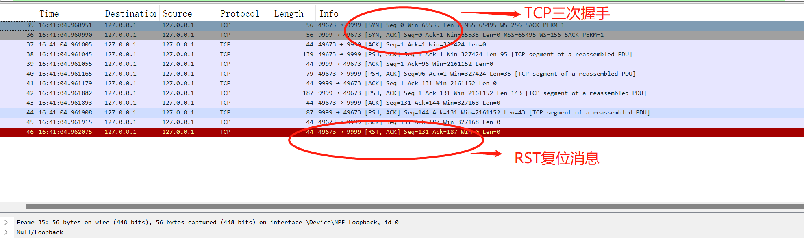
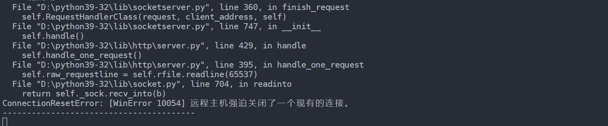
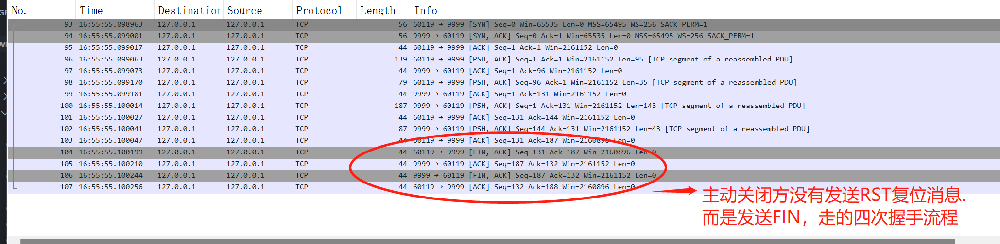
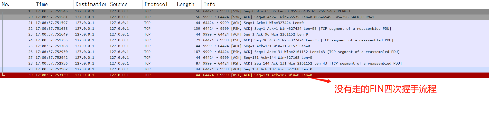
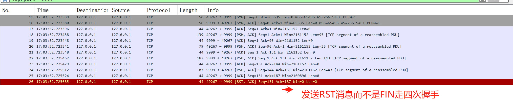
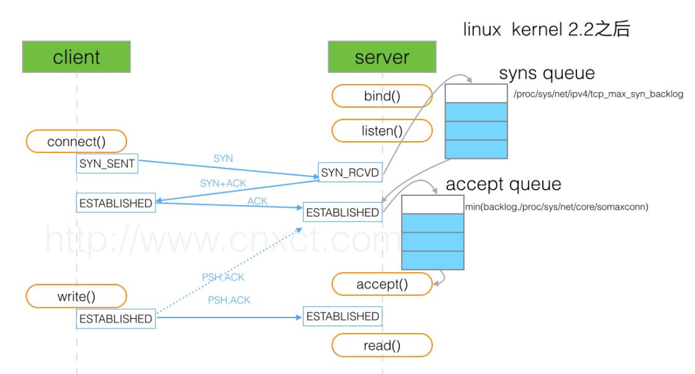
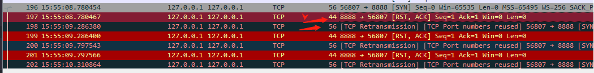
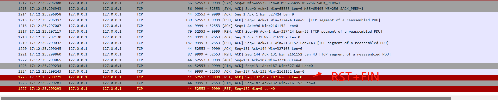

# shutdown和close的作用都是关闭一个TCP连接。简单来说,两者的不同地方有:
*  调用`socket.shutdown()`的话会走TCP断开四次握手流程,即是主动断开方会发送一个FIN消息
*  调用`socket.close()`的话会主动断开方会发送一个`RST`复位消息，然后马上断开抛弃这个socket,此时服务方可能会抛出一个`远程客户端已经关系`的异常.  
* shutdown()用来关闭连接,而不是套接字,不管调用多少次shutdown(),套接字依然存在,直到调用 close()将套接字从内存清除。

### socket.shutdown(参数类型)       
* SHUT_RD：断开输入流。套接字无法接收数据（即使输入缓冲区收到数据也被抹去），无法调用输入相关函数。
* SHUT_WR：断开输出流。套接字无法发送数据，但如果输出缓冲区中还有未传输的数据，则将传递到目标主机。
* SHUT_RDWR：同时断开 I/O 流。相当于分两次调用 shutdown()，其中一次以 SHUT_RD 为参数，另一次以 SHUT_WR 为参数。

### python自带的http.client         

python自带的http.client,官方关闭的方式为直接调用的`conn.close()`.看源码,即为直接调用的socket.close()    
```python

conn = http.client.HTTPConnection("127.0.0.1",9999)
url = "/"
conn.putrequest('PUT', url)
conn.putheader('Transfer-Encoding', 'chunked')
conn.endheaders()
conn.send(chunk_data(body, size_per_chunk).encode('utf-8'))
resp = conn.getresponse()
conn.close()

### HTTPConnection.close()源码:
def close(self):
    """Close the connection to the HTTP server."""
    self.__state = _CS_IDLE
    try:
        sock = self.sock
        if sock:
            self.sock = None
            sock.close()   # 这里直接调用的socket.close(),直接关闭双方的socket,而不经过握手阶段
    finally:
        response = self.__response
        if response:
            self.__response = None
            response.close()

```

### socket.close()发送了那些数据?   
我们写一个简单的HTTP服务,用`http.client`发送一个简单的请求后直接调用`close`方法,用抓包工具看下整个流程发送了那些状态包.
     
从抓到的数据包我们可以看到如果只是简单的调用了`close`,socket会直接发送一个`RST`消息并马上关闭socket,而不会发送`FIN`走4次握手去断开连接。        
被动关闭方收到`RST`后，由于此时主动关闭方已经关闭了socket连接，固此时会抛出一个`远程服务已经关闭的异常`     
      


### socket.shutdown()发送了那些数据？
我们接下来再把`http.client`的`close`注释掉，换成`socket.shutdown`,并且传入不同的SHUTDOWN参数,同样用抓包工具分析下整个过程.

- socket.shutdown(socket.SHUT_WR)       


- socket.shutdown(socket.SHUT_RD)  
     

- socket.shutdown(socket.SHUT_RDWR)
 


- 通过对不同参数的抓包分析可得.调用`socket.shutdown`的时候.如果传递的为SHUT_WR.此时socket会走正常的四次断开握手流程(fin消息).如果为其他,则还是跟直接调用的`socket.close`一样.直接发送的`RST`复位消息抛弃该socket连接.


### backlog参数
当我们编写socket绑定监听端口的时候,调用了系统提供socket.listen(),这个函数有个backlog,可以用来限定tcp握手过程中**半链接队列**和**全连接**队列的长度.

#### 半连接和全连接
每个TCP的链接队列都会进行3次握手,当客户端发起第一握手请求ACK到服务端,服务端收到后发送ACK+SYN到客户端,此时服务端会把该链接添加到半链接队列（SYN_REVD状态）.当客户端收到服务端的ACK+SYN消息后，回复ack给服务端，服务端收到后，把socket从半连接队列中取出，添加到完全链接队列中(ESTABLISHED状态)，等到服务端调用accept(),后,再把socket从完全队列中取出,链接建立。



当半连接队列满了之后,新的客户端请求链接会抛出**ConnectionRefusedError: [WinError 10061] 由于目标计算机积极拒绝，无法连接。**的错误。有抓包工具可知,当链接队列满了之后，再发送syn请求,会受到 ack+rst 的响应.👇:




## 总结
但用客户端做HTTP请求，如果自己手动关闭，则正确的方式应该为: `socket.shutdown(socket.SHUT_WR) --> socket.close()`        



